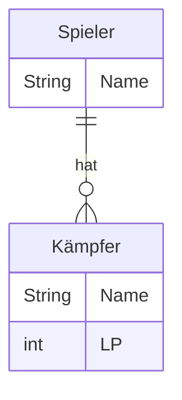

import Exercise from '@site/src/components/Exercise';

Erstelle die ausführbare Klasse `Kill Team` wie folgt: Es sollen Datenobjekte
für alle Eigenschaften des abgebildeten ER-Modells für 2 Spieler und 2 Kämpfer
(je einer pro Spieler) deklariert, initialisiert und auf der Konsole ausgegeben
werden

## ER-Modell



LP = Lebenspunkte

## Hinweis

Diese Aufgabe ist Teil einer Aufgabenreihe, in der Schritt für Schritt eine
abgespeckte Variante des Tabletop-Spiels
_[Warhammer 40,000 Kill Team](https://www.warhammer.com/en-GB/other-games-kill-team-LP)_
entwickelt werden soll. Bei diesem Strategiespiel für zwei Spieler kämpfen zwei
sogenannten Kill Teams mit dem Ziel gegeneinander, entsprechende Missionsziele
zu erfüllen bzw. das gegnerische Team auszulöschen.

## Konsolenausgabe

```console
Spieler 1, Name: Hans
Spieler 1, Kämpfer 1, Name: Gregor
Spieler 1, Kämpfer 1, LP: 8

Spieler 2, Name: Peter
Spieler 2, Kämpfer 1, Name: Bonekraka
Spieler 2, Kämpfer 1, LP: 10
```

<Exercise branchSuffix="data-objects-03" />
