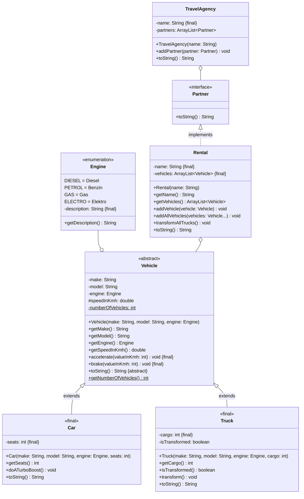

import Exercise from '@site/src/components/Exercise';

- Erstelle die Ausnahmenklasse `InvalidValueException`
- Passe die Klasse `Vehicle` anhand der Hinweise an
- Passe die ausführbare Klasse aus Übungsaufgabe
  [Interfaces01](../interfaces/interfaces01) so an, dass ein Auto mit einem
  ungültigen Wert beschleunigt wird und in der Konsole ausgegeben wird, dass der
  Wert größer als 0 sein muss.

## Hinweise zur Klasse _Vehicle_

- Die Methode `void accelerate(valueInKmh: int)` soll den eingehenden Wert
  überprüfen. Ist der eingehende Wert kleiner als 0 soll die Ausnahme
  `InvalidValueException` ausgelöst werden
- Die Methode `void brake(valueInKmh: int)` soll den eingehenden Wert
  überprüfen. Ist der eingehende Wert kleiner als 0 soll die Ausnahme
  `InvalidValueException` ausgelöst werden

<Exercise pullRequest="49" branchSuffix="exceptions/01" />
