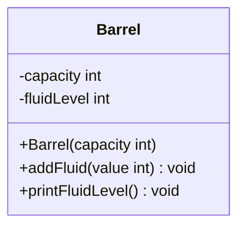

import Exercise from '@site/src/components/Exercise';

- Erstelle die Ausnahmenklasse `BarrelOverflowException` sowie die Klasse
  `Barrel` anhand des abgebildeten Klassendiagramms
- Erstelle eine ausführbare Klasse, welche es dem Anwender ermöglicht, ein Fass
  zu erzeugen und zu befüllen

## Klassendiagramm



## Hinweise zur Klasse Barrel

- Der Konstruktor soll das Attribut `capacity` initialisieren
- Die Methode `void addFluid(value: int)` soll den Füllstand um den eingehenden
  Betrag erhöhen. Bei Überschreiten der Kapazität soll die Ausnahme
  `BarrelOverflowException` ausgelöst werden
- Die Methode `void printFluidLevel()` soll den Füllstand auf der Konsole
  ausgeben

## Konsolenausgabe

```console
Gib bitte die Kapazität des Fasses ein: 100
Gib bitte die Menge der hinzuzufügenden Flüssigkeit ein: 30
Füllstand: 30
Gib bitte die Menge der hinzuzufügenden Flüssigkeit ein: 50
Füllstand: 80
Gib bitte die Menge der hinzuzufügenden Flüssigkeit ein: 40
Füllstand: 100
Das war der Tropfen, der das Fass zum Überlaufen gebracht hat
```

<Exercise pullRequest="50" branchSuffix="exceptions/02" />
