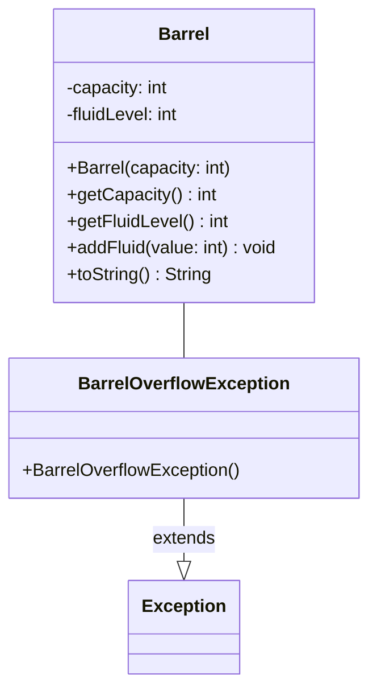

import Exercise from '@site/src/components/Exercise';

- Erstelle die Ausnahmenklasse `BarrelOverflowException` sowie die Klasse
  `Barrel` anhand des abgebildeten Klassendiagramms
- Erstelle eine ausführbare Klasse, welche es dem Anwender ermöglicht, ein Fass
  zu erzeugen und zu befüllen

## Klassendiagramm



## Hinweise zur Klasse _Barrel_

- Der Konstruktor soll alle Attribute initialisieren. Jedes Fass, dass erstellt
  wird ist leer.

- Die Methode **getCapacity** soll die Kapazität des Fasses zurückgeben.

- Die Methode **getFluidLevel** soll die aktuelle Füllmenge des Fasses
  zurückgeben.

- Die Methode **addFluid** soll den Füllstand um den eingehenden Betrag erhöhen.

  Ist der eingehende Betrag höher als die verfügbare Restkapazität soll der
  Füllstand die maximale Füllmenge haben und anschließend die
  BarrelOverflowException auslösen.

  Ist der eingehende Betrag kleiner oder gleich groß wie die verfügbare
  Restkapazität soll der Füllstand um die eingehende Menge erhöht werden.

- Die Methode **toString** soll alle Attribute des Objektes als String
  zurückgeben.

  Beispiel: `Barrel [capacity=10] [fluidlevel=8]`

## Konsolenausgabe

```console
Gib bitte die Kapazität des Fasses ein: 100
Gib bitte die Menge der hinzuzufügenden Flüssigkeit ein: 30
Füllstand: 30
Gib bitte die Menge der hinzuzufügenden Flüssigkeit ein: 50
Füllstand: 80
Gib bitte die Menge der hinzuzufügenden Flüssigkeit ein: 40
Füllstand: 100
Das war der Tropfen, der das Fass zum Überlaufen gebracht hat
```

<Exercise pullRequest="50" branchSuffix="exceptions/02" />
