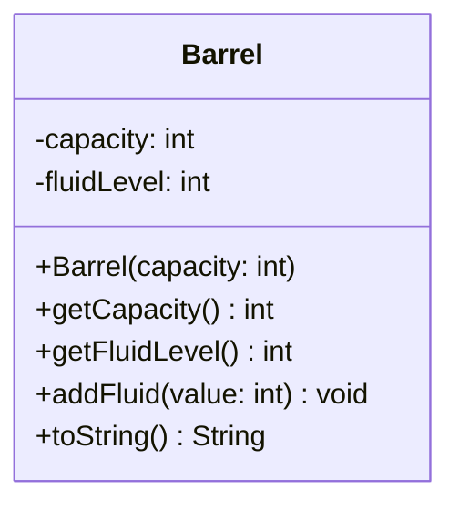

import Exercise from '@site/src/components/Exercise';

- Erstelle die Ausnahmenklasse `BarrelOverflowException`
- Erstelle die Klasse `Barrel` anhand des abgebildeten Klassendiagramms
- Erstelle eine ausführbare Klasse, welche es dem Anwender ermöglicht, ein Fass
  zu erzeugen und zu befüllen

## Klassendiagramm



## Hinweise zur Klasse _Barrel_

- Der Konstruktor soll alle Attribute initialisieren. Jedes Fass soll dabei
  standardmäßig leer sein
- Die Methode `int getCapacity()` soll die Kapazität des Fasses zurückgeben
- Die Methode `int getFluidLevel()` soll die aktuelle Füllmenge des Fasses
  zurückgeben
- Die Methode `void addFluid(value: int)` soll den Füllstand um den eingehenden
  Betrag erhöhen. Ist der eingehende Betrag höher als die verfügbare
  Restkapazität, soll der Füllstand auf die maximale Füllmenge gesetzt und
  anschließend die Ausnahme `BarrelOverflowException` ausgelöst werden. Ist der
  eingehende Betrag kleiner oder gleich groß wie die verfügbare Restkapazität,
  soll der Füllstand um die eingehende Menge erhöht werden.
- Die Methode `String toString()` soll alle Attribute in der Form _Barrel
  [capacity=[maximale Füllmenge]] [fluidlevel=[Füllstand]]_ zurückgeben

## Konsolenausgabe

```console
Gib bitte die Kapazität des Fasses ein: 100
Gib bitte die Menge der hinzuzufügenden Flüssigkeit ein: 30
Füllstand: 30
Gib bitte die Menge der hinzuzufügenden Flüssigkeit ein: 50
Füllstand: 80
Gib bitte die Menge der hinzuzufügenden Flüssigkeit ein: 40
Füllstand: 100
Das war der Tropfen, der das Fass zum Überlaufen gebracht hat
```

<Exercise pullRequest="50" branchSuffix="exceptions/02" />
