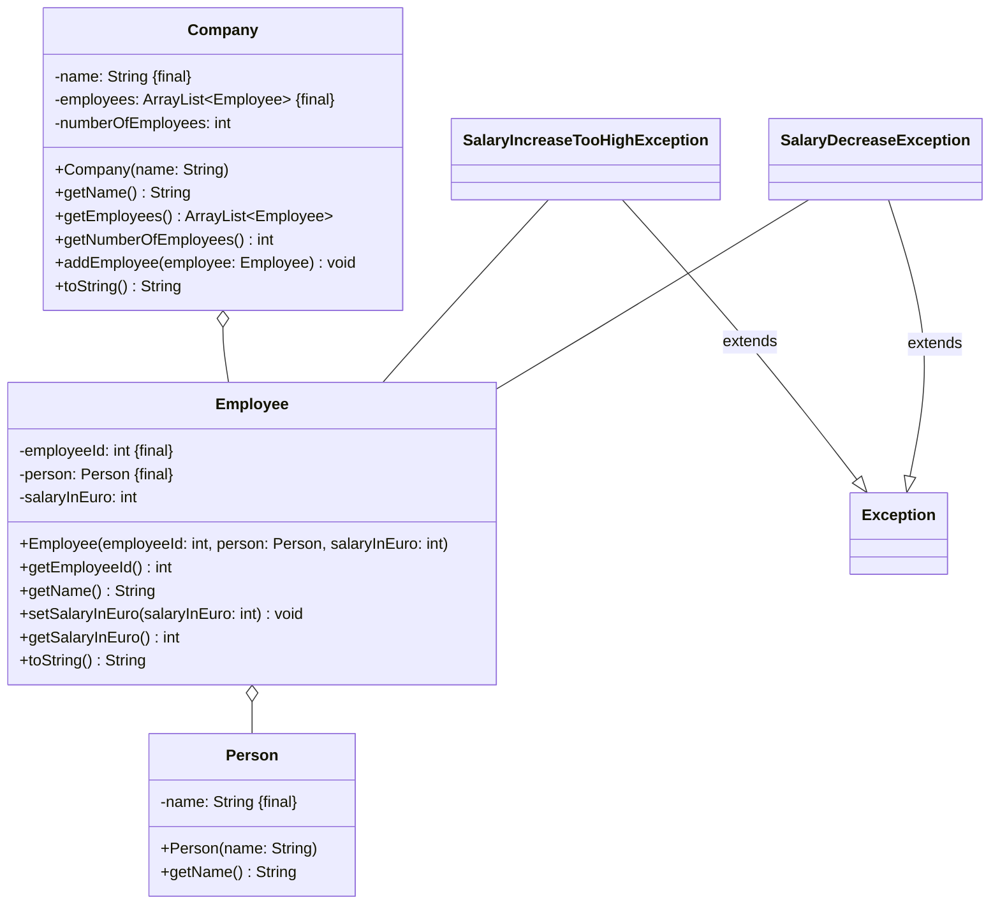

import Exercise from '@site/src/components/Exercise';

- Erstelle die Klassen **SalaryIncreaseTooHighException** und
  **SalaryDecreaseException**.
- Passe die Klasse Employee an.
- Passe die ausführbare Klasse aus Übungsaufgabe
  [ClassDiagrams04](../class-diagrams/class-diagrams04) so an, dass ein oder
  mehrere Mitarbeiter eine Gehaltserhöhung bekommen. Behandle alle möglichen
  Ausnahmen und gebe passende Fehlermeldungen in der Konsole aus.

## Hinweise zur Klasse _Employee_

- Die Methode **setSalaryInEuro** soll das Gehalt eines Mitarbeiters festlegen.

  Ist das eingehende Gehalt mehr als 10% des bestehenden Gehalts, soll die
  **SalaryIncreaseTooHighException** ausgelöst werden.

  Ist das eingehende Gehalt weniger als das bestehende Gehalt, soll die
  **SalaryDecreaseException** ausgelöst werden.

<Exercise pullRequest="51" branchSuffix="exceptions/03" />
