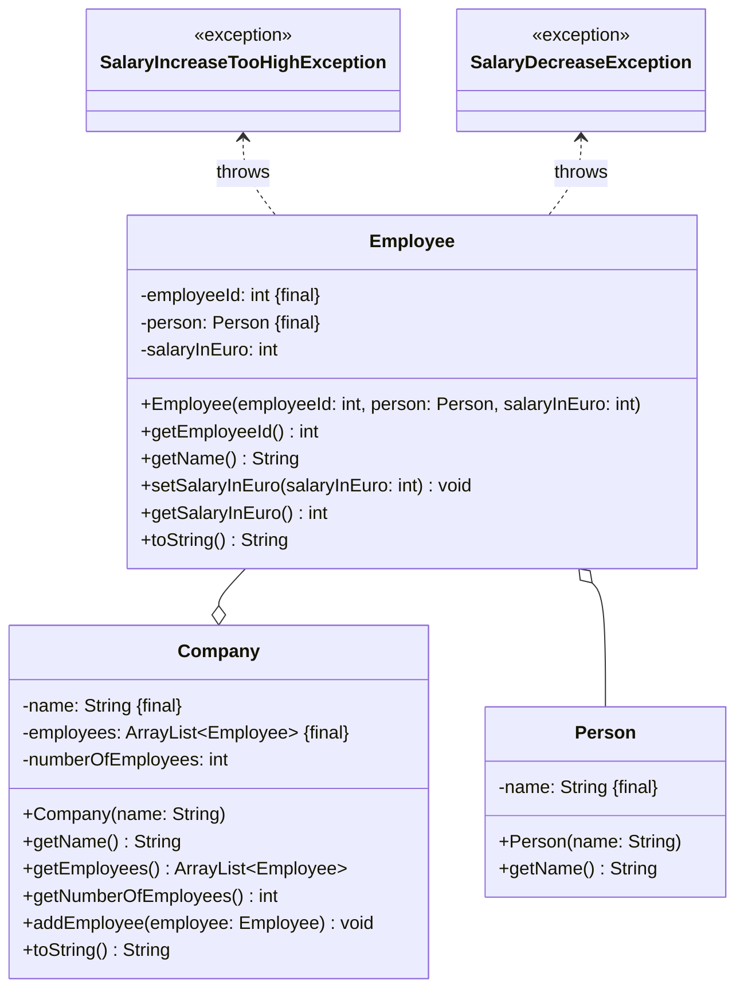

import Exercise from '@site/src/components/Exercise';

- Erstelle die Ausnhamenklassen `SalaryIncreaseTooHighException` sowie
  `SalaryDecreaseException` anhand des abgebildeten Klassendiagramms
- Passe die Klasse `Employee` anhand der Hinweise an
- Passe die ausführbare Klasse aus Übungsaufgabe
  [ClassDiagrams04](../class-diagrams/class-diagrams04) so an, dass ein oder
  mehrere Mitarbeiter eine Gehaltserhöhung bekommen. Behandle alle möglichen
  Ausnahmen und gebe passende Fehlermeldungen in der Konsole aus.

## Hinweis zur Klasse _Employee_

Die Methode `void setSalaryInEuro(salaryInEuro: int)` soll das Gehalt eines
Mitarbeiters festlegen. Ist das eingehende Gehalt mehr als 10% des bestehenden
Gehalts, soll die Ausnhame `SalaryIncreaseTooHighException` ausgelöst werden.
Ist das eingehende Gehalt weniger als das bestehende Gehalt, soll die Ausnhame
`SalaryDecreaseException` ausgelöst werden.

<Exercise pullRequest="51" branchSuffix="exceptions/03" />
