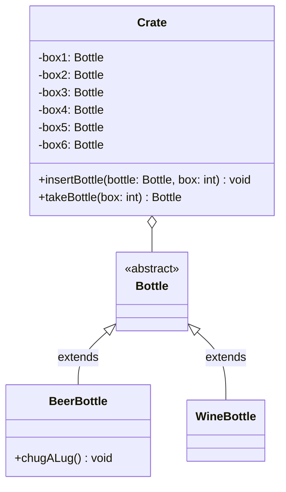

import Exercise from '@site/src/components/Exercise';

- Erstelle die Klassen `Bottle`, `BeerBottle`, `WineBottle` und `Crate` anhand
  des abgebildeten Klassendiagramms
- Erstelle eine ausführbare Klasse, welche eine Getränkiste sowie mehrere
  Flaschen erzeugt und die Flaschen in die Getränkekiste stellt

## Klassendiagramm

## Hinweis zur Klasse _BeerBottle_

Die Methode `void chugALug()` soll den Text "Ex und Hopp" auf der Konsole
ausgeben.

## Hinweise zur Klasse _Crate_

- Die Methode `void insertBottle(bottle: Bottle, box: int)` soll eine Flasche in
  eine der 6 Getränkefächer einfügen
- Die Methode `Bottle takeBottle(box: int)` soll die Flasche des entsprechenden
  Getränkefachs zurückgeben

<Exercise branchSuffix="generics-01" />
