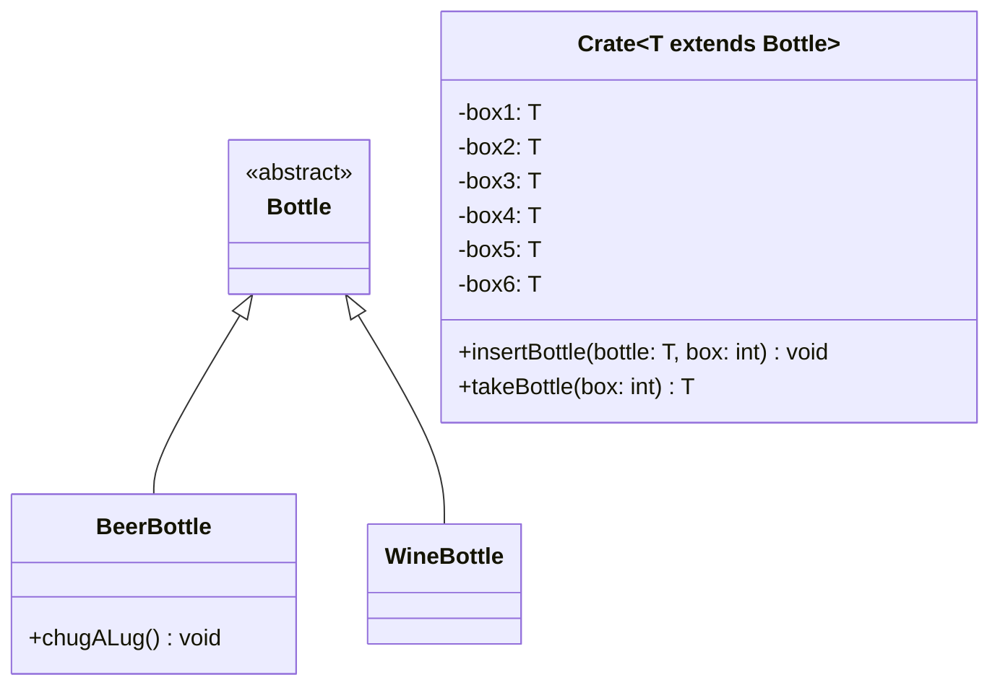

import Exercise from '@site/src/components/Exercise';

- Passe die Klasse `Crate` aus Übungsaufgabe [Generics01](generics01) anhand des
  abgebildeten Klassendiagramms an
- Passe die ausführbare Klasse aus Übungsaufgabe [Generics01](generics01) so an,
  dass sie fehlerfrei ausgeführt werden kann

## Klassendiagramm

<Exercise pullRequest="53" branchSuffix="generics/02" />
