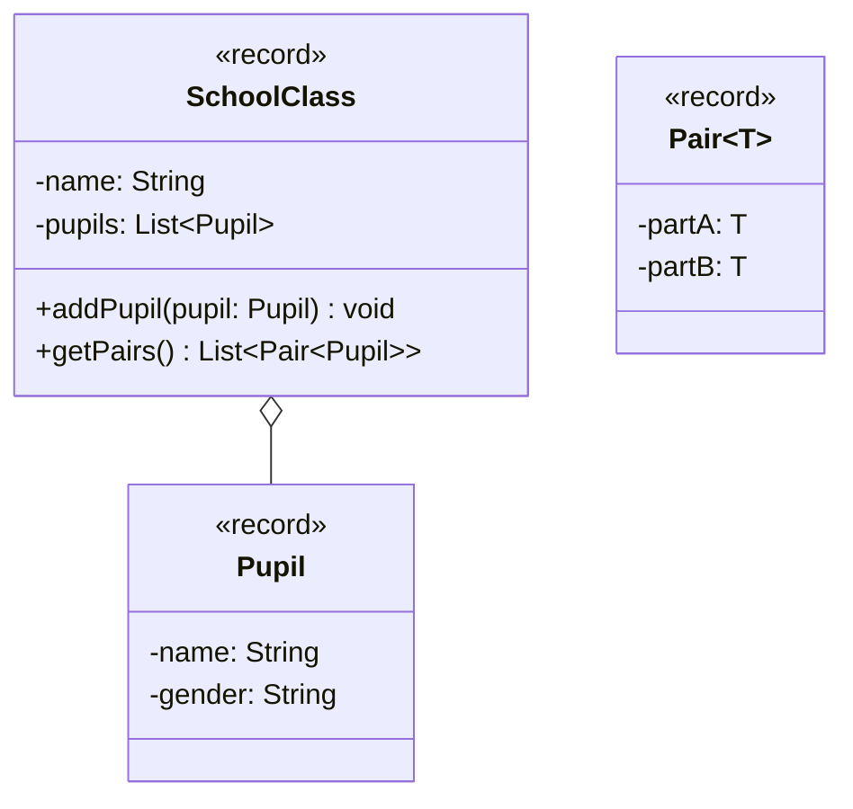

import Exercise from '@site/src/components/Exercise';

- Erstelle die Klassen `Pair`, `Pupil` und `SchoolClass` anhand des abgebildeten
  Klassendiagramms
- Erstelle eine ausführbare Klasse, welche eine Schulklasse mit mehreren
  Schülern erzeugt und die Schülerpaare ausgibt

## Klassendiagramm



## Hinweise zur Klasse _SchoolClass_

- Die Methode `void addPupil(pupil: Pupil)` soll der Schulklasse den eingehenden
  Schüler hinzufügen
- Die Methode `List<Pair<Pupil>> getPairs()` soll aus den Schülern der
  Schulklasse zufällige Paare bilden und zurückgeben. Bei einer ungeraden Anzahl
  an Schülern soll der verbleibende Schüler mit dem Wert `null` gepaart werden

## Konsolenausgabe

```console
Schüler:
Franziska
Fritz
Hans
Jennifer
Lisa
Max
Peter

Paare:
Jennifer - Franziska
Fritz - Lisa
Max - Hans
Peter - null
```

<Exercise pullRequest="64" branchSuffix="generics/03" />
