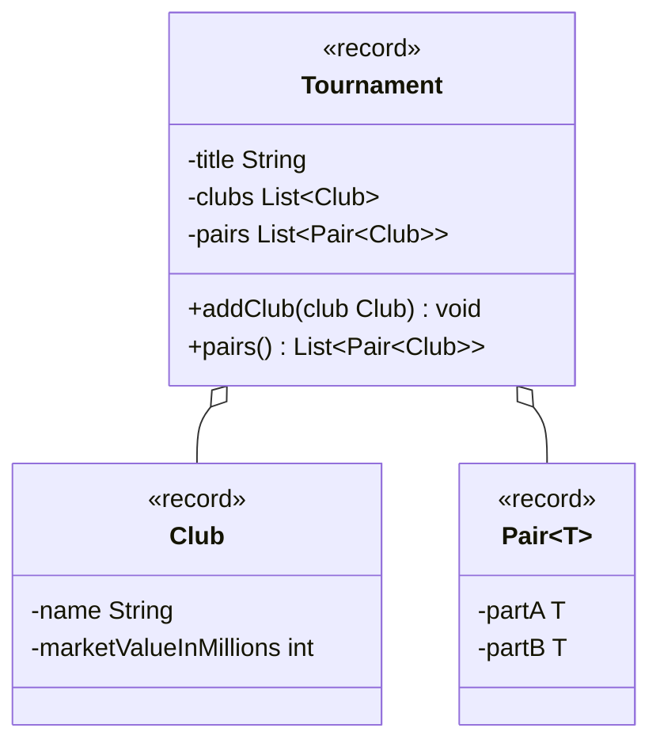

import Exercise from '@site/src/components/Exercise';

- Erstelle die Klassen `Club` und `Tournament` anhand des abgebildeten Klassendiagramms
- Erstelle eine ausführbare Klasse, welche ein Turnier mit mehreren Vereinen erzeugt und die Paarungen ausgibt

## Klassendiagramm



## Hinweise zur Klasse Tournament

- Die Methode `void addClub(club: Club)` soll dem Turnier den eingehenden Verein hinzufügen
- Die Methode `List<Pair<Club>> pairs()` soll aus den Vereinen des Turniers Paarungen für Hin- und Rückspiele bilden und zurückgeben

## Konsolenausgabe

```console
Pair[partA=Club[name=SC Freiburg, marketValueInMillions=165], partB=Club[name=Bayern Muenchen, marketValueInMillions=926]]
Pair[partA=Club[name=SC Freiburg, marketValueInMillions=165], partB=Club[name=Borussia Dortmund, marketValueInMillions=462]]
Pair[partA=Club[name=Bayern Muenchen, marketValueInMillions=926], partB=Club[name=SC Freiburg, marketValueInMillions=165]]
Pair[partA=Club[name=Bayern Muenchen, marketValueInMillions=926], partB=Club[name=Borussia Dortmund, marketValueInMillions=462]]
Pair[partA=Club[name=Borussia Dortmund, marketValueInMillions=462], partB=Club[name=SC Freiburg, marketValueInMillions=165]]
Pair[partA=Club[name=Borussia Dortmund, marketValueInMillions=462], partB=Club[name=Bayern Muenchen, marketValueInMillions=926]]
```

<Exercise pullRequest="65" branchSuffix="generics/04" />
