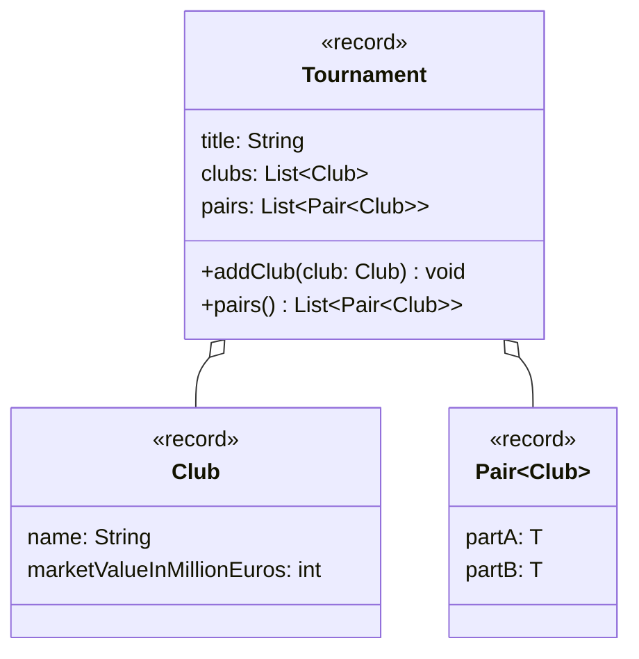

import Exercise from '@site/src/components/Exercise';

- Erstelle die Klassen `Club` und `Tournament` anhand des abgebildeten
  Klassendiagramms
- Erstelle eine ausführbare Klasse, welche ein Turnier mit mehreren Vereinen
  erzeugt und die Paarungen ausgibt

## Klassendiagramm



## Hinweise zur Klasse _Tournament_

- Die Methode `void addClub(club: Club)` soll dem Turnier den eingehenden Verein
  hinzufügen
- Die Methode `List<Pair<Club>> pairs()` soll aus den Vereinen des Turniers
  Paarungen für Hin- und Rückspiele bilden und zurückgeben

## Konsolenausgabe

```console
SC Freiburg - Bayern Muenchen
SC Freiburg - Borussia Dortmund
Bayern Muenchen - SC Freiburg
Bayern Muenchen - Borussia Dortmund
Borussia Dortmund - SC Freiburg
Borussia Dortmund - Bayern Muenchen
```

<Exercise pullRequest="65" branchSuffix="generics/04" />
