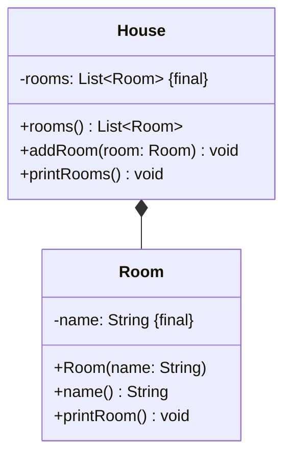

import Exercise from '@site/src/components/Exercise';

- Erstelle die Klassen `House` und `Room` anhand des abgebildeten
  Klassendiagramms
- Erstelle eine ausführbare Klasse, welche ein Haus mit mehreren Räumen erzeugt
  und auf der Konsole ausgibt
- Die Klasse Room soll hierbei eine Element Klasse sein.

## Klassendiagramm



## Konsolenausgabe

```console
Wohnzimmer
Esszimmer
Schlafzimmer
Küche
WC
```

<Exercise pullRequest="54" branchSuffix="inner-classes/01" />
