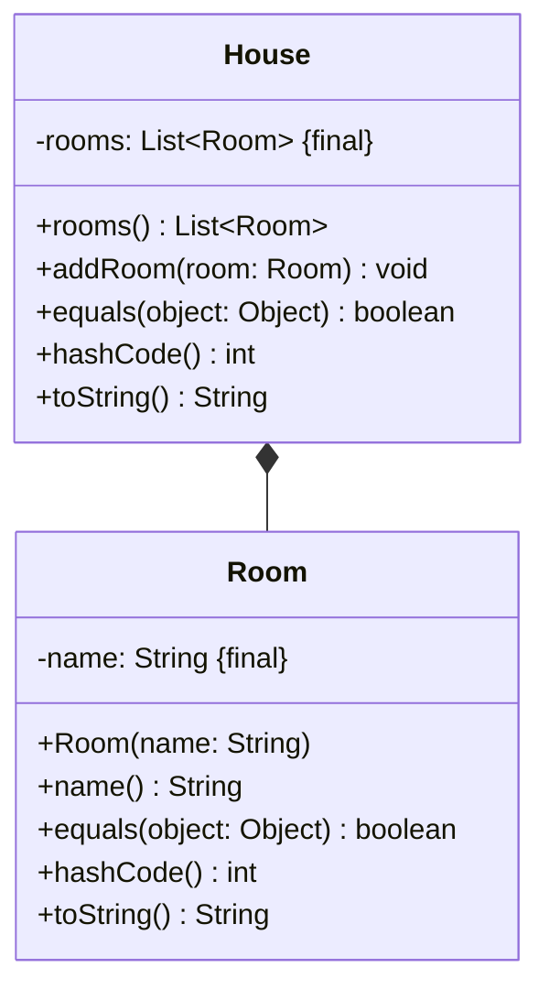

import Exercise from '@site/src/components/Exercise';

- Erstelle die Klassen `House` und `Room` anhand des abgebildeten
  Klassendiagramms
- Erstelle eine ausführbare Klasse, welche ein Haus mit mehreren Räumen erzeugt
  und auf der Konsole ausgibt

## Klassendiagramm



## Konsolenausgabe

```console
Wohnzimmer
Esszimmer
Schlafzimmer
Küche
WC
```

<Exercise branchSuffix="inner-classes-01" />
