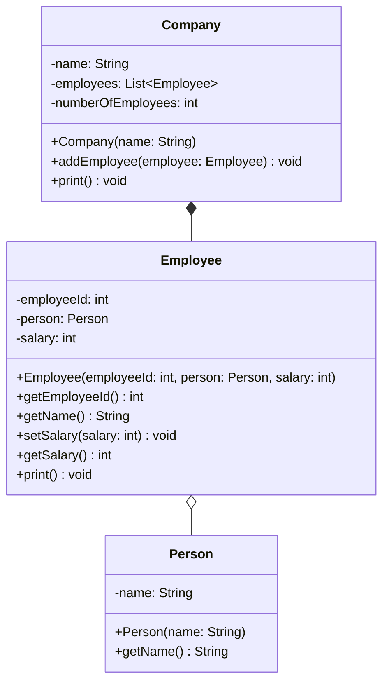

import Exercise from '@site/src/components/Exercise';

- Passe die Klassen `Company` und `Employee` aus Übungsaufgabe
  [Exceptions03](../exceptions/exceptions03) anhand des abgebildeten
  Klassendiagramms an
- Passe die ausführbare Klasse aus Übungsaufgabe
  [Exceptions03](../exceptions/exceptions03) so an, dass sie fehlerfrei
  ausgeführt werden kann
- Die Klasse Emplyee soll hierbei eine Element Klasse sein.

## Klassendiagramm

<Exercise pullRequest="55" branchSuffix="inner-classes/02" />
