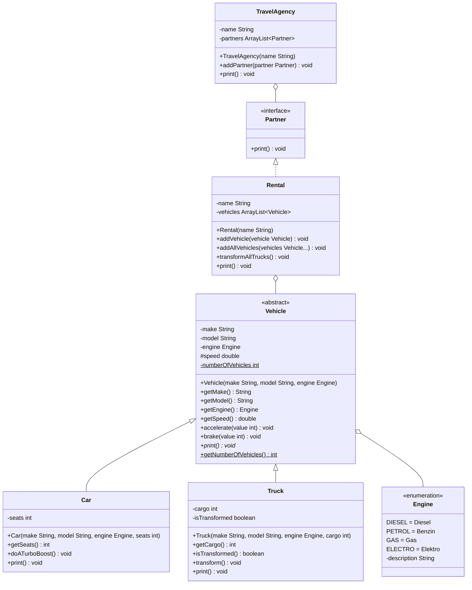

import Exercise from '@site/src/components/Exercise';

- Passe die Klasse `Rental` aus Übungsaufgabe
  [Abstract and Final 01](../abstract-and-final/abstract-and-final01) anhand des
  abgebildeten Klassendiagramms an und erstelle die Klasse `TravelAgency` sowie
  die Schnittstelle `Partner`
- Passe die ausführbare Klasse aus Übungsaufgabe
  [Abstract and Final 01](../abstract-and-final/abstract-and-final01)) so an,
  dass ein Reisebüro erzeugt wird, dass diesem die Autovermietung hinzugefügt
  wird und dass alle Attribute des Reisebüros ausgegeben werden

## Klassendiagramm



## Hinweise zur Klasse TravelAgency

- Der Konstruktor soll alle Attribute initialisieren
- Die Methode `void addPartner(partner: Partner)` soll dem Reisebüro einen
  Partner hinzufügen
- Die Methode `void print()` soll alle Attribute auf der Konsole ausgeben

## Konsolenausgabe

```console
Reisebüro Schmidt
Unsere Partner:
Fahrzeugvermietung Müller
Unsere Fahrzeuge:
Porsche 911 (Elektro, 2 Sitzplätze)
MAN TGX (Diesel, 20t)
Opel Zafira Life (Diesel, 7 Sitzplätze)
```

<Exercise pullRequest="46" branchSuffix="interfaces/01" />
