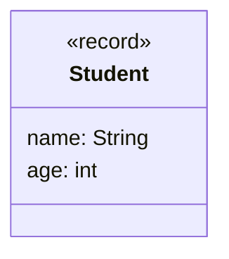

- Erstelle die Klasse `Student` anhand des abgebildeten Klassendiagramms
- Erstelle eine ausführbare Klasse, welche entweder mehrere Objekte der Klasse
  `Student` erzeugt und diese zeichenbasiert in eine Datei schreibt oder diese
  aus der Datei ausliest und ausgibt

## Klassendiagramm



## Konsolenausgabe

```console
Moechtest Du Lesen (1) oder Schreiben (2): 1
Student[name=Hans Maier, age=19
Student[name=Peter Mueller, age=23]
Student[name=Lisa Schmid, age=20]
```
