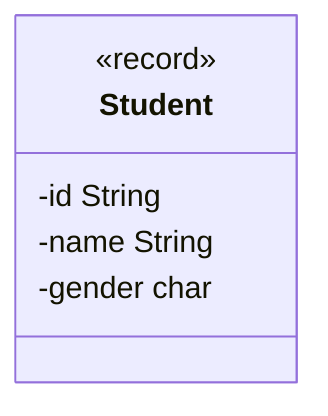

- Erstelle die Klasse `Student` anhand des abgebildeten Klassendiagramms
- Erstelle eine ausführbare Klasse, welche entweder mehrere Objekte der Klasse
  `Student` erzeugt und diese zeichenbasiert in eine Datei schreibt oder diese
  aus der Datei ausliest und ausgibt

## Klassendiagramm



## Konsolenausgabe

```console
Moechtest Du Lesen (1) oder Schreiben (2): 1
Student[id=8172093, name=Hans Maier, gender=m]
Student[id=2335409, name=Peter Mueller, gender=m]
Student[id=5065411, name=Lisa Schmid, gender=w]
```
