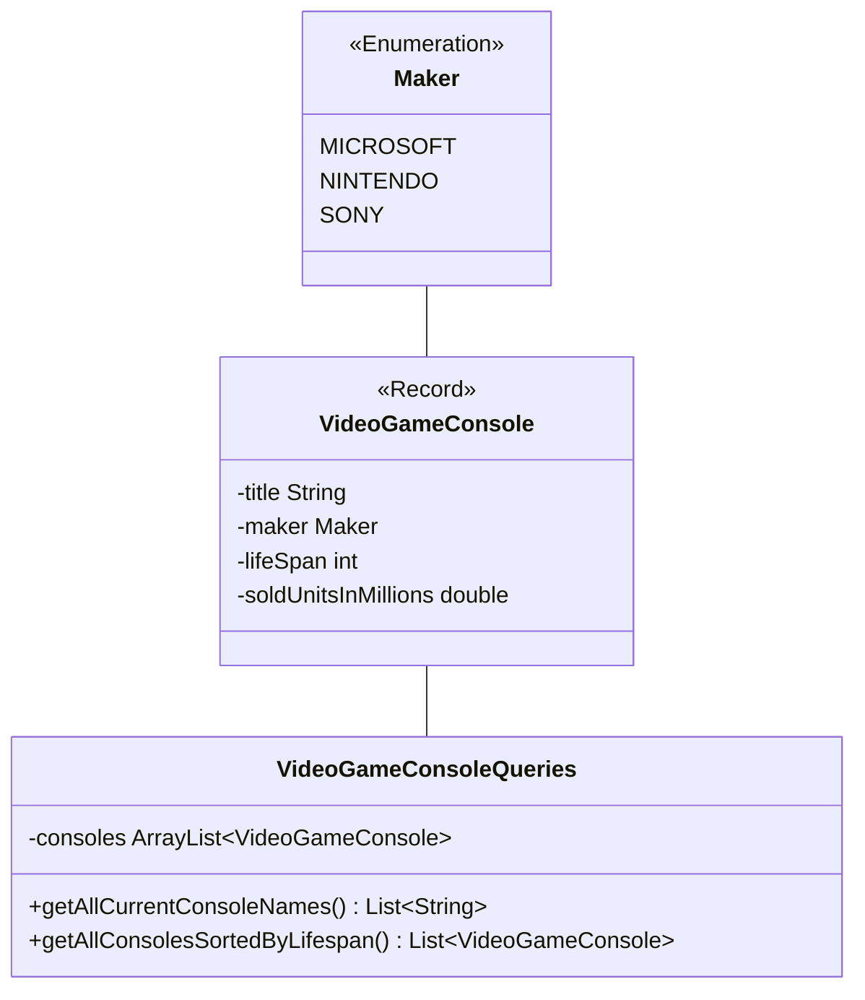

- Erstelle die Klassen `VideoGameConsoles` und `VideoGameConsoleQueries` anhand des abgebildeten Quellcodes sowie des abgebildeten Klassendiagramms
- Erstelle eine ausführbare Klasse, welche alle erstellten Abfragen ausführt und die Ergebnisse auf der Konsole ausgibt



## Quellcode
```java title="VideoGameConsoles.java" showLineNumbers
public class VideoGameConsoles {

  private final static VideoGameConsole PS2 =
      new VideoGameConsole("PlayStation 2", Maker.SONY, 12, 158.70);
  private final static VideoGameConsole DS =
      new VideoGameConsole("Nintendo DS", Maker.NINTENDO, 10, 154.02);
  private final static VideoGameConsole NS =
      new VideoGameConsole("Nintendo Switch", Maker.NINTENDO, -1, 125.79);
  private final static VideoGameConsole GB =
      new VideoGameConsole("GameBoy", Maker.NINTENDO, 10, 118.69);
  private final static VideoGameConsole PS4 =
      new VideoGameConsole("PlayStation 4", Maker.SONY, -1, 117.04);
  private final static VideoGameConsole PSX =
      new VideoGameConsole("PlayStation", Maker.SONY, 9, 102.49);
  private final static VideoGameConsole WII =
      new VideoGameConsole("Nintendo Wii", Maker.NINTENDO, 13, 101.63);
  private final static VideoGameConsole PS3 =
      new VideoGameConsole("PlayStation 3", Maker.SONY, 11, 87.40);
  private final static VideoGameConsole X360 =
      new VideoGameConsole("XBox 360", Maker.MICROSOFT, 12, 85.81);
  private final static VideoGameConsole GBA =
      new VideoGameConsole("GameBoy Advance", Maker.NINTENDO, 7, 81.51);
  private final static VideoGameConsole PSP =
      new VideoGameConsole("PlayStation Portable", Maker.SONY, 9, 80.79);
  private final static VideoGameConsole TDS =
      new VideoGameConsole("Nintendo 3DS", Maker.NINTENDO, 8, 75.94);
  private final static VideoGameConsole NES =
      new VideoGameConsole("Nintendo Entertainment System", Maker.NINTENDO, 9, 61.91);
  private final static VideoGameConsole XONE =
      new VideoGameConsole("XBox One", Maker.MICROSOFT, -1, 51.26);
  private final static VideoGameConsole SNES =
      new VideoGameConsole("Super Nintendo Entertainment System", Maker.NINTENDO, 7, 49.10);

  public static record VideoGameConsole(String title, Maker maker, int lifespan, double soldUnitsInMillions) {

  }

  public static enum Maker {
    MICROSOFT, NINTENDO, SONY;
  }

  public static ArrayList<VideoGameConsole> getVideoGameConsoles() {
    ArrayList<VideoGameConsole> videoGameConsoles = new ArrayList<>();
    videoGameConsoles.add(PS2);
    videoGameConsoles.add(DS);
    videoGameConsoles.add(NS);
    videoGameConsoles.add(GB);
    videoGameConsoles.add(PS4);
    videoGameConsoles.add(PSX);
    videoGameConsoles.add(WII);
    videoGameConsoles.add(PS3);
    videoGameConsoles.add(X360);
    videoGameConsoles.add(GBA);
    videoGameConsoles.add(PSP);
    videoGameConsoles.add(TDS);
    videoGameConsoles.add(NES);
    videoGameConsoles.add(XONE);
    videoGameConsoles.add(SNES);
    return videoGameConsoles;
  }

}
```
## Klassendiagramm


## Hinweis zur Klasse VideoGameConsole
Konsolen, die aktuell noch verkauft werden, besitzen bei der Lebensspanne den Wert `-1` (Stand: 14.06.2023)

## Hinweise zur Klasse VideoGameConsoleQueries
- Die Methode `List<String> getAllCurrentConsoleNames()` soll die Namen aller Konsolen, die aktuell noch verkauft werden zurückgeben (_Nintendo Switch, PlayStation 4, XBox One_)
- Die Methode `List<VideoGameConsole> getAllConsolesSortedByLifespan()` soll alle Konsolen absteigend sortiert nach der Lebensspanne zurückgeben (_VideoGameConsole\[title=Nintendo Wii, maker=NINTENDO, lifespan=13, soldUnits=101.63]_,...)
- Die Methode `boolean isAnyConsoleWithMoreThan150MillionSoldUnits()` soll die Antwort auf die Frage, ob es eine Konsole mit mehr als 150 Millionen verkauften Einheiten gibt, zurückgeben (_true_)
- Die Methode `boolean isAllConsolesWithMoreThan50MillionSoldUnits()` soll die Antwort auf die Frage, ob von allen Konsolen mehr als 50 Millionen Einheiten verkauft wurden, zurückgeben (_false_)
- Die Methode `long getNumberOfConsolesFromNintendo()` soll die Anzahl der Konsolen von Nintendo zurückgeben (_8_)
- Die Methode `List<String> getSoldUnitsInMillionsPerYearFromAllOutdatedConsoles()` soll die Namen aller Konsolen, die nicht mehr verkauft werden sowie die Anzahl verkaufter Einheiten pro Jahr in Millionen zurückgeben (_PlayStation 2 (13.225)_,...)
- Die Methode `OptionalDouble getAverageSoldUnitsInMillionsPerYearFromAllOutdatedConsoles()` soll den Durchschnitt verkaufter Einheiten pro Jahr in Millionen aller Konsolen, die nicht mehr verkauft werden zurückgeben (_9.900365412365412_)
- Die Methode `Map<Maker, List<VideogameConsole>> getAllConsolesByMaker()` soll alle Konsolen gruppiert nach den Herstellern zurückgeben (_MICROSOFT: \[VideoGameConsole\[title=XBox 360, maker=MICROSOFT, lifespan=12, soldUnitsInMillions=85.81]_,...],...)
- Die Methode `Map<Maker, Double> getTotalSoldUnitsInMillionsPerMaker()` soll die Anzahl verkaufter Einheiten pro Hersteller in Millionen zurückgeben (_MICROSOFT: 137.07_,...)
