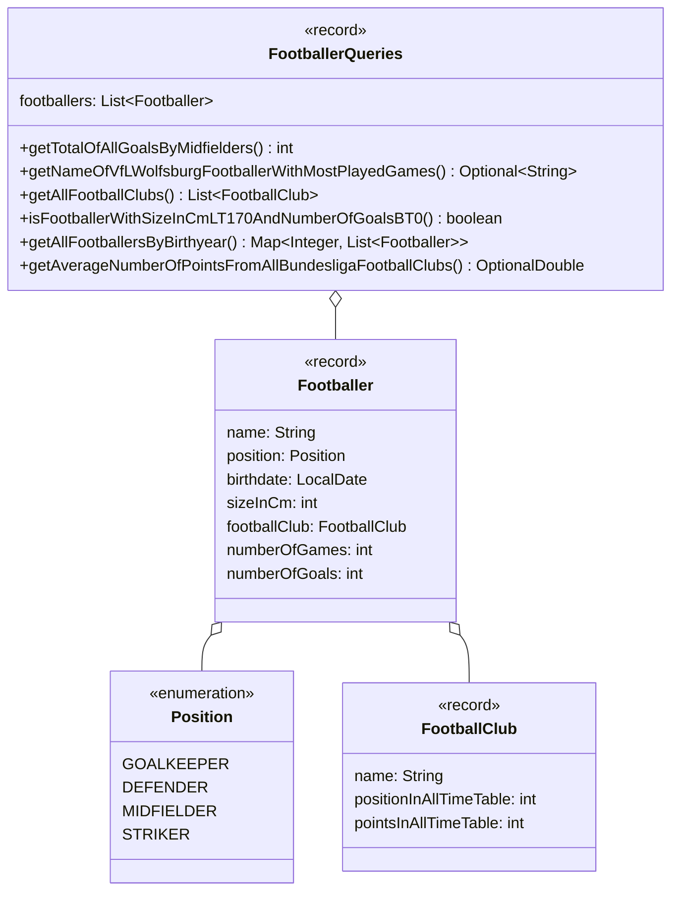

import Exercise from '@site/src/components/Exercise';

- Erstelle die Klassen `FootballClub`, `Position`, `Footballer` und
  `FootballerQueries` anhand des abgebildeten Klassendiagramms
- Erstelle eine ausführbare Klasse, welche alle erstellten Abfragen ausführt und
  die Ergebnisse auf der Konsole ausgibt

## Klassendiagramm

## Hinweise zur Klasse _FootballerQueries_

- Mannschaften, die nicht der ewigen Tabelle der Bundesliga vertreten sind,
  besitzen sowohl für die Position als auch die Punktzahl den Wert `-1`
- Die Methode `int getTotalOfAllGoalsByMidfielders()` soll die Summe aller
  geschossener Tore von Mittelfeldspielerinnen zurückgeben
- Die Methode
  `Optional<String> getNameOfVfLWolfsburgFootballerWithMostPlayedGames()` soll
  den Namen der Spielerin vom VfL Wolfsburg mit den meisten Spielen zurückgeben
- Die Methode `List<FootballClub> getAllFootballClubs()` soll alle Vereine
  zurückgeben
- Die Methode `boolean isFootballerWithSizeInCmLT170AndNumbreOfGoalsBT0()` soll
  die Antwort auf die Frage, ob es eine Spielerin gibt, die kleiner als 170cm
  ist und mindestens ein Tor geschossen hat, zurückgeben
- Die Methode `Map<Integer, List<Footballer>> getAllFootballersByBirthyear()`
  soll alle Spielerinnen gruppiert nach ihrem Geburtsjahr zurückgeben
- Die Methode
  `OptionalDouble getAverageNumberOfPointsFromAllBundesligaFootballClubs()` soll
  die durchschnittliche Punktzahl aller Bundesligamannschaften in der Ewigen
  Tabelle zurückgeben

<Exercise pullRequest="72" branchSuffix="stream-api/02" />
