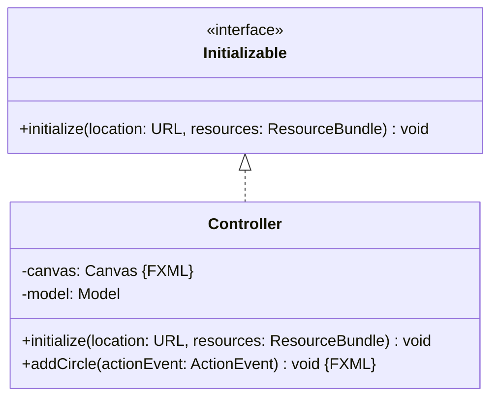
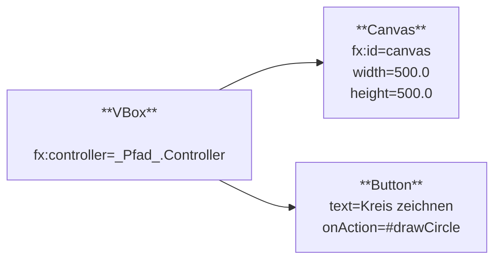

Erstelle eine JavaFX-Anwendung zum Zeichnen beliebig vieler, unterschiedlich
großer und unterschiedlich farbiger Kreise anhand des abgebildeten
Klassendiagramms sowie des abgebildeten Szenegraphs.

## Klassendiagramm

## Szenegraph

## Allgemeine Hinweise

- Die Methode `GraphicsContext getGraphicsContext2D()` der Klasse `Canvas` gibt
  die Grafik einer Leinwand zurück
- Die Methoden `double getWidth()` und `double getHeight` der Klasse `Canvas`
  geben die Breite bzw. die Höhe einer Leinwand zurück
- Die Methode `void setFill(p: Paint)` der Klasse `GraphicsContext` setzt die
  Füllfarbe einer Grafik auf den eingehenden Wert
- Die Methoden `void fillRect(x: double, y: double, w: double, h: double)` und
  `void fillOval(x: double, y: double, w: double, h: double)` der Klasse
  `GraphicsContext` zeichnen ein ausgefülltes Rechteck bzw. ein ausgefülltes
  Oval mit den eingehenden Informationen und der aktuellen Füllfarbe auf die
  Grafik
- Der Konstruktor
  `Color(red: double, green: double, blue: double, opacity: double)` der Klasse
  `Color` ermöglicht das Erzeugen einer (durchsichtigen) Farbe

## Hinweise zur Klasse _Controller_

- Die Methode `void initialize(location: URL, resources: ResourceBundle)` soll
  die Leinwand weiß anmalen
- Die Methode `void drawCircle(actionEvent: ActionEvent)` soll einen Kreis mit
  einer zufälligen Größe und einer zufälligen Farbe auf eine zufällige Position
  der Leinwand zeichnen
