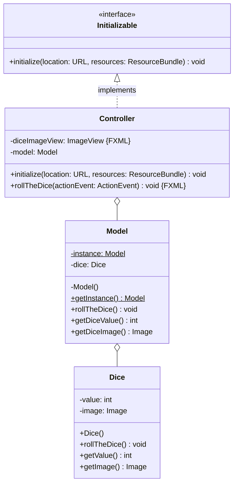
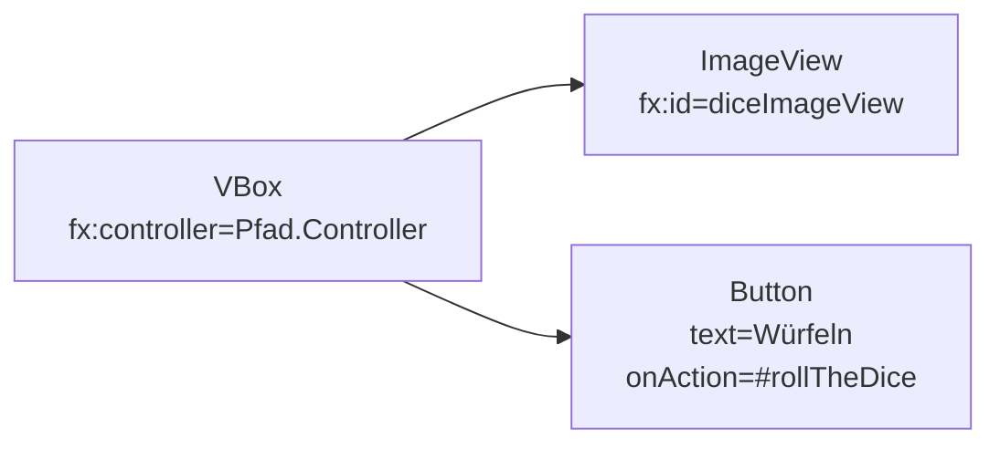

Erstelle eine JavaFX-Anwendung zum Würfeln anhand des abgebildeten
Klassendiagramms sowie des abgebildeten Szenegraphs.

## Klassendiagramm

## Szenegraph

## Allgemeiner Hinweis

Der Konstruktor `Image(url: String)` der Klasse `Image` ermöglicht das Erzeugen
eines Grafik-Objektes.

## Hinweise zur Klasse _Dice_

- Der Konstruktor soll den Würfel werfen
- Die Methode `void rollTheDice()` soll den Würfelwert auf einen zufälligen Wert
  zwischen 1 und 6 setzen und dem Würfelbild eine entsprechende Grafik zuweisen

## Hinweise zur Klasse _Model_

- Der Konstruktor soll den Würfel initialisieren
- Die Methode `void rollTheDice()` soll den Würfel werfen

## Hinweise zur Klasse _Controller_

- Die Methode `void initialize(location: URL, resources: ResourceBundle)` soll
  das Model initialisieren, den Würfel werfen und dem Würfelbilderrahmen ein
  entsprechendes Würfelbild zuweisen
- Die Methode `void rollTheDice(actionEvent: ActionEvent)` soll den Würfel
  werfen und dem Würfelbilderrahmen ein entsprechendes Würfelbild zuweisen
