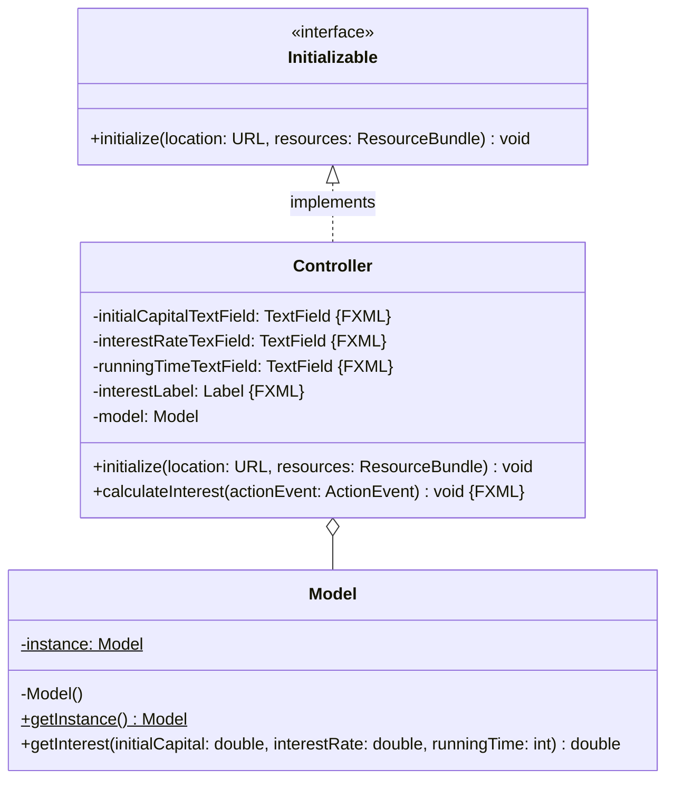
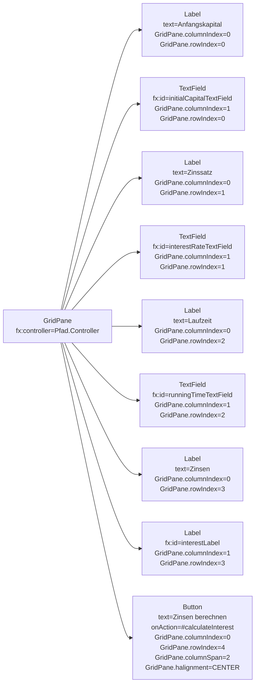

Erstelle eine JavaFX-Anwendung zum Berechnen von Zinsen anhand des abgebildeten
Klassendiagramms sowie des abgebildeten Szenegraphs.

## Klassendiagramm

## Szenegraph

## Allgemeine Hinweise

- Der Konstruktor
  `Alert(alertType: AlertType, contentText: String, buttons: ButtonType...)` der
  Klasse `Alert` ermöglicht das Erzeugen eines Nachrichtendialoges
- Die Methode `void show()` der Klasse `Alert` zeigt den Nachrichtendialog an

## Hinweis zur Klasse _Model_

Die Methode
`double getInterest(initialCapital: double, interestRate: double, runningTime: int)`
soll die Zinsen zu den eingehenden Informationen berechnen und zurückgeben.

## Hinweise zur Klasse _Controller_

- Die Methode `void initialize(location: URL, resources: ResourceBundle)` soll
  das Model initialisieren
- Die Methode `void calculateInterest(actionEvent: ActionEvent)` soll zu den
  eingegebenen Informationen die Zinsen berechnen und diese dem
  Zinsen-Ausgabenfeld zuweisen. Für den Fall, dass die eingegebenen
  Informationen nicht konvertiert werden können, soll ein entsprechender
  Nachrichtendialog angezeigt werden und für den Fall, dass die eingegebenen
  Werte kleiner gleich Null sind, soll ebenfalls ein entsprechender
  Nachrichtendialog angezeigt werden
