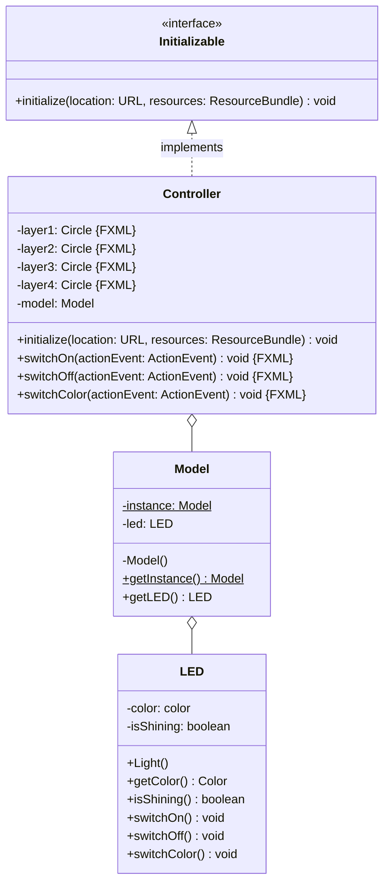
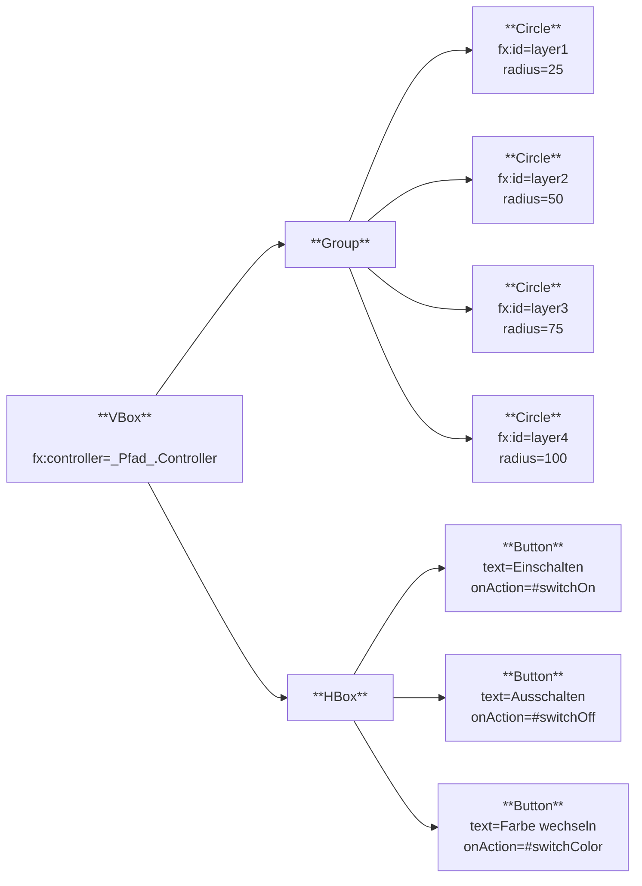

Erstelle eine JavaFX-Anwendung zum Ein- und Ausschalten einer farbigen LED
anhand des abgebildeten Klassendiagramms sowie des abgebildeten Szenegraphs.

## Klassendiagramm

## Szenegraph

## Allgemeine Hinweise

- Die Klasse `AnimationTimer` repräsentiert einen Zeitmesser
- Die Methode `void start()` der Klasse `AnimationTimer` startet den Zeitmesser
- Der Konstruktor
  `Color(red: double, green: double, blue: double, opacity: double)` der Klasse
  `Color` ermöglicht das Erzeugen einer (durchsichtigen) Farbe

## Hinweise zur Klasse _LED_

- Der Konstruktor soll die LED auf die Farbe Rot setzen
- Die Methode `void switchOn()` soll das Attribut `isShining` auf den Wert
  _true_ setzen
- Die Methode `void switchOff()` soll das Attribut `isShining` auf den Wert
  _false_ setzen
- Die Methode `void switchColor()` soll die Farbe der LED von Rot auf Grün bzw.
  von Grün auf Blau bzw. von Blau auf Rot wechseln

## Hinweis zur Klasse _Model_

Der Konstruktor soll die LED initialisieren

## Hinweise zur Klasse _Controller_

- Die Methode `void initialize(location: URL, resources: ResourceBundle)` soll
  das Model initialisieren und kontinuierlich prüfen, ob die LED leuchtet. Für
  den Fall, dass die LED leuchtet, sollen alle 4 Ebenen in der Farbe der LED mit
  aufsteigender Durchsichtigkeit (0%, 25%, 50%, 75%) angezeigt werden und für
  den Fall, dass die LED nicht leuchtet, soll aussschließlich die erste Ebene in
  der Farbe der LED angezeigt werden
- Die Methode `void switchOn(actionEvent: ActionEvent)` soll die LED einschalten
- Die Methode `void switchOff(actionEvent: ActionEvent)` soll die LED
  ausschalten
- Die Methode `void switchColor(actionEvent: ActionEvent)` soll die Farbe der
  LED wechseln
