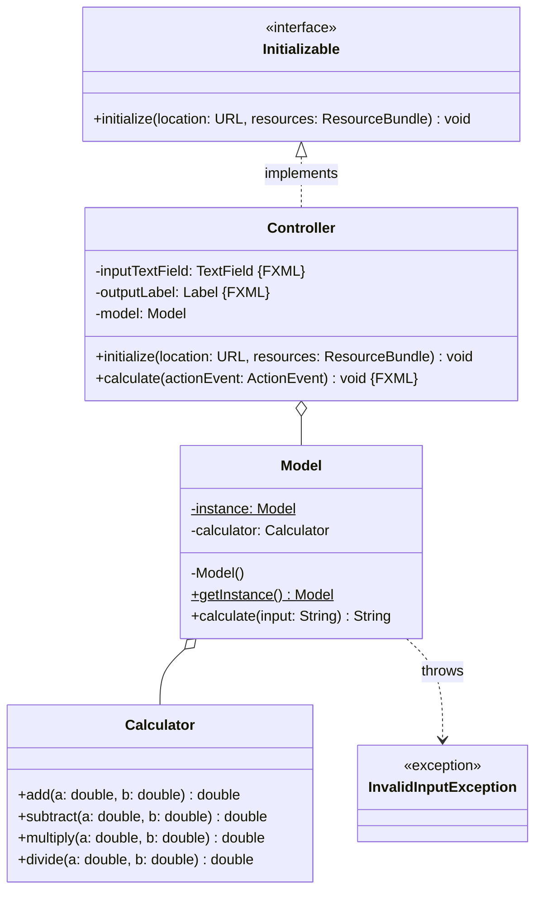
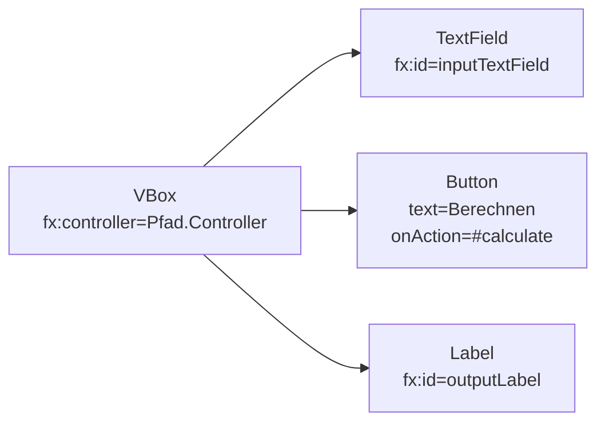

Erstelle eine JavaFX-Anwendung zum Durchführen einfacher Berechnungen anhand des
abgebildeten Klassendiagramms sowie des abgebildeten Szenegraphs.

## Klassendiagramm

## Szenegraph

## Allgemeine Hinweise

- Der Konstruktor
  `Alert(alertType: AlertType, contentText: String, buttons: ButtonType...)` der
  Klasse `Alert` ermöglicht das Erzeugen eines Nachrichtendialoges
- Die Methode `void show()` der Klasse `Alert` zeigt den Nachrichtendialog an

## Hinweise zur Klasse _Calculator_

- Die Methode `double add(a: double, b: double)` soll die Summe der eingehenden
  Zahlen zurückgeben
- Die Methode `double subtract(a: double, b: double)` soll die Differenz der
  eingehenden Zahlen zurückgeben
- Die Methode `double multiply(a: double, b: double)` soll das Produkt der
  eingehenden Zahlen zurückgeben
- Die Methode `double divide(a: double, b: double)` soll den Quotienten der
  eingehenden Zahlen zurückgeben

## Hinweise zur Klasse _Model_

- Der Konstruktor soll den Taschenrechner initialisieren
- Die Methode `String calculate(input: String)` soll die eingehende Zeichenkette
  in zwei Kommazahlen sowie einen Operator umwandeln, anschließend die
  entsprechende Berechnung durchführen und schließlich das Ergebnis der
  Berechnung zurückgeben. Für den Fall, dass die eingehende Zeichenkette den
  Wert `null` hat oder dass die Eingabe nicht dem Format _Kommazahl +|-|\*|/
  Kommazahl_ entspricht, soll die Ausnahme `InvalidInputException` ausgelöst
  werden

## Hinweise zur Klasse _Controller_

- Die Methode `void initialize(location: URL, resources: ResourceBundle)` soll
  das Model initialisieren
- Die Methode `void calculate(actionEvent: ActionEvent)` soll anhand der Eingabe
  das Ergebnis berechnen und dieses dem Ausgabe-Ausgabefeld zuweisen. Für den
  Fall, dass die Eingabe ungültig ist, soll ein entsprechender Nachrichtendialog
  angezeigt werden
