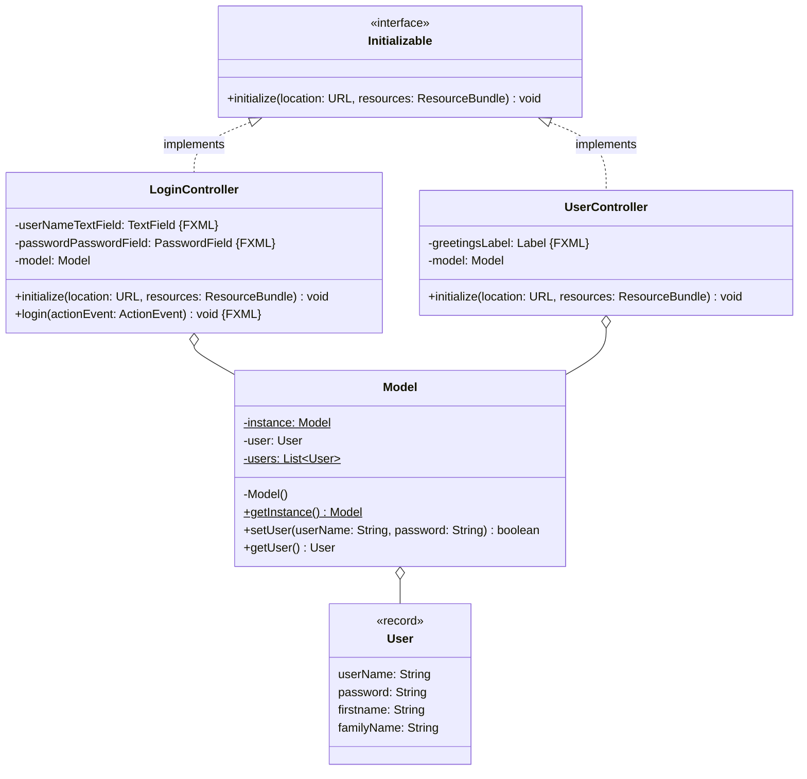
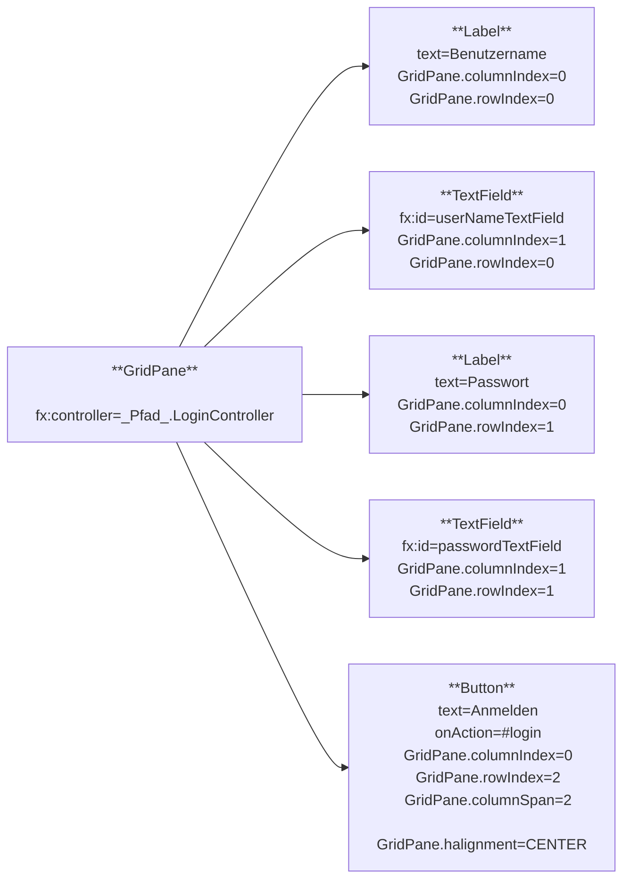
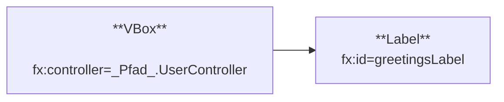

Erstelle eine JavaFX-Anwendung zum Anmelden anhand des abgebildeten
Klassendiagramms sowie der abgebildeten Szenegraphen.

## Klassendiagramm

## Szenegraph zur Szene _LoginView_

## Szenegraph zur Szene _UserView_

## Allgemeine Hinweise

- Der Konstruktor
  `Alert(alertType: AlertType, contentText: String, buttons: ButtonType...)` der
  Klasse `Alert` ermöglicht das Erzeugen eines Nachrichtendialoges
- Die Methode `void show()` der Klasse `Alert` zeigt den Nachrichtendialog an

## Hinweise zur Klasse _Model_

- Der Konstruktor soll die Beuntzerliste initialisieren und dieser einige
  Benutzern hinzufügen
- Die Methode `boolean setUser(userName: String, password: String)` soll den
  Benutzer festlegen und den Wert `true` zurückgeben. Für den Fall, dass zu den
  eingehenden Anmeldedaten kein Benutzer in der Benutzerliste ermittelt werden
  kann, soll der Wert `false` zurückgegeben werden

## Hinweise zur Klasse _LoginController_

- Die Methode `void initialize(location: URL, resources: ResourceBundle)` soll
  das Model initialisieren
- Die Methode `void login(actionEvent: ActionEvent)` soll anhand der
  eingegebenen Anmeldedaten den Benutzer festlegen und anschließend die View
  `UserView` anzeigen. Für den Fall, dass die Anmeldedaten ungültig sind, soll
  ein entsprechender Nachrichtendialog angezeigt werden

## Hinweis zur Klasse _UserController_

Die Methode `void initialize(location: URL, resources: ResourceBundle)` soll das
Model initialisieren und dem Begrüßungs-Ausgabfeld eine Zeichenkette in der Form
_Hallo [Benutzer].[Vorname] [Benutzer].[Nachname]_ zuweisen.
