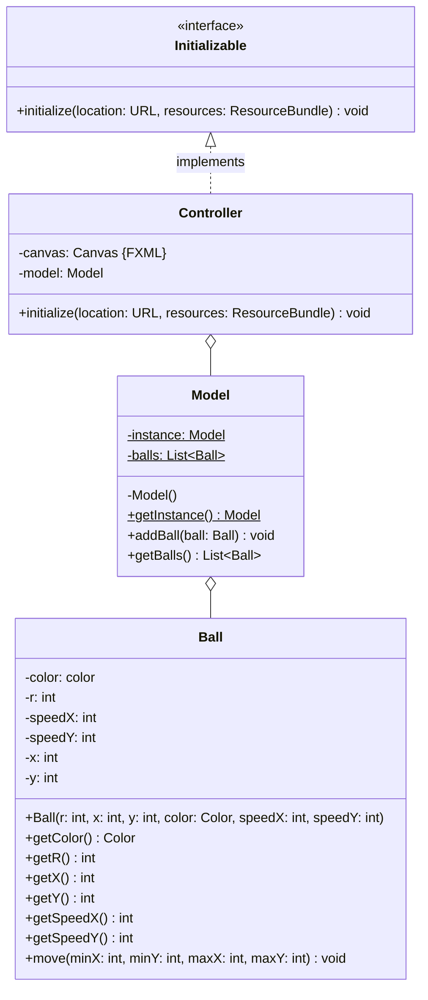
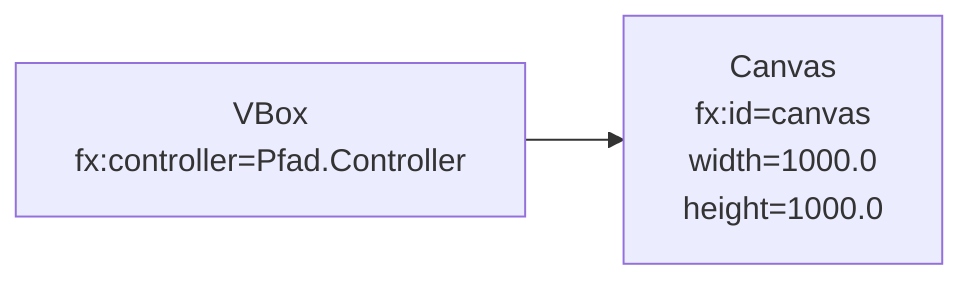

Erstelle eine JavaFX-Anwendung zur Animation beliebig vieler, unterschiedlich
großer, unterschiedlich farbiger und unterschiedlich schneller Gummibälle anhand
des abgebildeten Klassendiagramms sowie des abgebildeten Szenegraphs.

## Klassendiagramm

## Szenegraph

## Allgemeine Hinweise

- Die Klasse `AnimationTimer` repräsentiert einen Zeitmesser
- Die Methode `void start()` der Klasse `AnimationTimer` startet den Zeitmesser
- Die Methode `GraphicsContext getGraphicsContext2D()` der Klasse `Canvas` gibt
  die Grafik einer Leinwand zurück
- Die Methoden `double getWidth()` und `double getHeight` der Klasse `Canvas`
  geben die Breite bzw. die Höhe einer Leinwand zurück
- Die Methode `void setFill(p: Paint)` der Klasse `GraphicsContext` setzt die
  Füllfarbe einer Grafik auf den eingehenden Wert
- Die Methoden `void fillRect(x: double, y: double, w: double, h: double)` und
  `void fillOval(x: double, y: double, w: double, h: double)` der Klasse
  `GraphicsContext` zeichnen ein ausgefülltes Rechteck bzw. ein ausgefülltes
  Oval mit den eingehenden Informationen und der aktuellen Füllfarbe auf die
  Grafik
- Der Konstruktor
  `Color(red: double, green: double, blue: double, opacity: double)` der Klasse
  `Color` ermöglicht das Erzeugen einer (durchsichtigen) Farbe

## Hinweise zur Klasse _Ball_

- Der Konstruktor soll alle Attribute initialisieren
- Die Methode `void move()` soll die x- und y-Position des Balls um die
  dazugehörigen Geschwindigkeitswerte erhöhen und sicherstellen, dass der Ball
  beim Überschreiten der eingehenden Grenzen an diesen "abprallt"

## Hinweise zur Klasse _Model_

- Der Konstruktor soll die Gummiballliste initialisieren
- Die Methode `void addBall(ball: Ball)` soll den eingehenden Gummiball der
  Gummiballliste hinzufügen

## Hinweis zur Klasse _Controller_

Die Methode `void initialize(location: URL, resources: ResourceBundle)` soll das
Model initialisieren und kontinuierlich alle Gummibälle der Gummiballliste
bewegen sowie die Leinwand neu zeichnen. Zudem soll bei einem Mausklick auf die
Leinwand an der geklickten Stelle ein Gummiball zufälliger Größe, Farbe und
Geschwindigkeitswerten erstellt werden.
