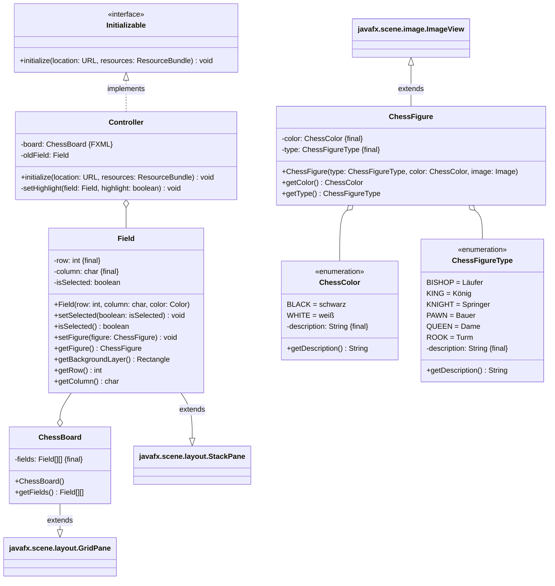
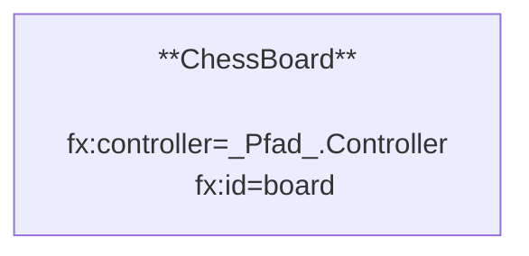

Erstelle eine JavaFX-Anwendung zum Schachspielen anhand des abgebildeten
Klassendiagramms sowie des abgebildeten Szenegraphs.

## Klassendiagramm

## Szenegraph

## Allgemeine Hinweise

- Der Konstruktor `Image(url: String)` der Klasse `Image` ermöglicht das
  Erzeugen eines Grafik-Objektes
- Die Methode `void setImage(value: Image)` der Klasse `ImageView` setzt die
  Grafik eines Bilderrahmens auf den eingehenden Wert
- Der Konstruktor `Rectangle(width: double, height: double)` der Klasse
  `Rectangle` ermöglicht das Erzeugen eines Rechtecks
- Die Methode `void setFill(value: Paint)` der Klasse `Shape` setzt die
  Füllfarbe einer geometrischen Form auf den eingehenden Wert
- Die Methode `ObservableList<Node> getChildren()` der Klasse `Pane` gibt die
  Kindknotenliste eines Containers zurück
- Die Methode `void setEffect(effect: Effect)` der Klasse `Node` setzt den
  Effekt eines Bildschirmelements auf den eingehenden Wert
- Der Konstruktor
  `ColorAdjust(hue: double, saturation: double, brightness: double, contrast: double)`
  der Klasse `ColorAdjust` ermöglicht das Erzeugen einer Farbanpassung

## Hinweis zur Klasse _ChessFigure_

Der Konstruktor soll alle Attribute (inklusive der Grafik) initialisieren.

## Hinweise zur Klasse _Field_

- Der Konstruktor soll alle Attribute initialisieren, ein Rechteck als
  Hintergrund-Ebene mit der eingehenden Farbe erzeugen und dieses der
  Kindknotenliste hinzufügen
- Die Methode `void setFigure(figure: ChessFigure)` soll die eingehende
  Schachfigur der Kindknoteliste hinzufügen bzw. die bestehende Schachfigur der
  Kinknotenliste durch die eingehende Schachfigur ersetzen bzw. die bestehende
  Schachfigur der Kindknotenliste entfernen
- Die Methode `ChessFigure getFigure()` soll die Schachfigur der Kindknotenliste
  bzw. den Wert `null` zurückgeben
- Die Methode `Rectangle getBackgroundLayer()` soll die Hintergrund-Ebene der
  Kindknotenliste zurückgeben

## Hinweise zur Klasse _ChessBoard_

Der Konstruktor soll alle Felder inklusive aller Schachfiguren initialisieren.

## Hinweise zur Klasse _Controller_

- Die Methode `void initialize(location: URL, resources: ResourceBundle)` soll
  das Auswählen und Bewegen der Schachfiguren per Mausklick ermöglichen
- Die Methode `void setHighlight(field: Field, highlight: boolean)` soll das
  eingehende Feld hervorheben bzw. nicht mehr hervorheben
