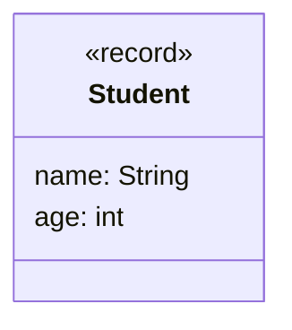

import Exercise from '@site/src/components/Exercise';

- Erstelle die Klasse `Student` anhand des abgebildeten Klassendiagramms
- Erstelle eine ausführbare Klasse, welche mehrere Objekte der Klasse `Student`
  erzeugt und diese einer Liste hinzufügt
- Rufe in der ausführbaren Klasse die forEach-Methode auf, und übergib eine
  anonyme Klasse. Die anonyme Klasse soll alle Studenten die älter sind als 26
  auf der Konsole ausgeben
- Rufe in der ausführbaren Klasse die forEach-Methode auf, und übergib einen
  Lambda-Ausdruck. Der Lambda-Ausdruck soll sich exakt so verhalten wie die
  zuvor implementierte anonyme Klasse

## Klassendiagramm



## Konsolenausgabe

```console
Yannik ist 28 Jahre alt
Hanni ist 29 Jahre alt
Manu ist 30 Jahre alt
```

<Exercise branchSuffix="lambdas-01" />
