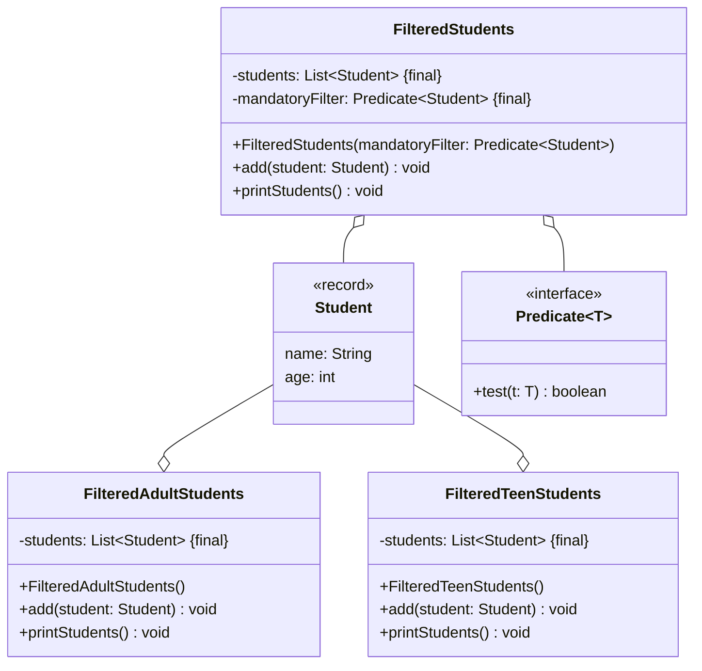

import Exercise from '@site/src/components/Exercise';

Gegeben sind die beiden Klassen `FilteredAdultStudents` und
`FilteredTeenStudents`. Beide sollen sicherstellen, dass nur bestimmte Studenten
hinzugefügt werden können. Die Klasse `FilteredAdultStudents` ermöglicht nur das
Hinzufügen von Studenten, die mindesten 18 Jahre alt sind; die Klasse
`FilteredTeenStudents` das Hinzufügen von Studenten unter 18 Jahren. Dieser
Ansatz funktioniert zwar, ist allerdings nicht flexibel.

- Erstelle eine ausführbare Klasse, welche mehrere Objekte der Klasse `Student`
  erzeugt und versucht, diese Objekten der Klasse `FilteredAdultList` bzw.
  `FilteredTeenList` hinzuzufügen
- Erstelle die Klasse `FilteredStudents` anhand des abgebildeten
  Klassendiagramms
- Passe die ausführbare Klasse so an, dass nur noch die Klasse
  `FilteredStudents` verwendet wird und übergib dem Konstruktor das Prädikat
  jeweils in Form eines Lambda-Ausdrucks

## Klassendiagramm

## Hinweise zur Klasse _FilteredStudents_

- Der Konstruktor soll alle Attribute initialisieren
- Die Methode `void add(student: Student)` soll der Studentenliste den
  eingehenden Studenten hinzufügen. Vor dem Hinzufügen soll mit Hilfe des
  Filters überprüft werden, ob der eingehende Student hinzugefügt werden soll
- Methode `void printStudent()` soll alle Studenten auf der Konsole ausgeben

<Exercise pullRequest="68" branchSuffix="lambdas/02" />
