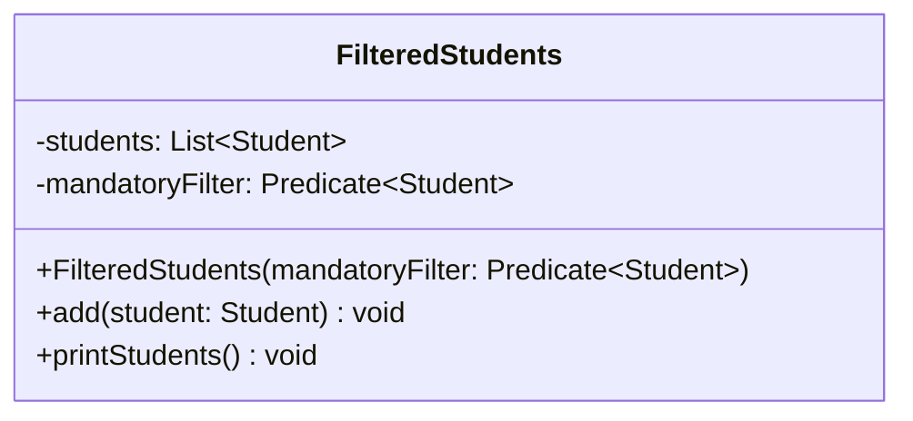

import Exercise from '@site/src/components/Exercise';

Gegeben sind die beiden Klassen `FilteredAdultStudents` und
`FilteredTeenStudents`. Beide sollen sicherstellen, dass nur bestimmte Objekte
hinzugefügt werden können. Die Klasse `FilteredAdultStudents` ermöglicht nur das
Hinzufügen von Studenten, die mindesten 18 Jahre alt sind; die Klasse
`FilteredTeenStudents` das Hinzufügen von Studenten unter 18 Jahren. In der
Klasse `Exercise` wird ein erwachsener Student sowie ein jugendlicher Student
erzeugt. Die Studenten werden den beiden FilteredStudents-Klassen hinzugefügt
und anschließend ausgegeben. Dieser Ansatz funktioniert zwar, ist allerdings
nicht flexibel.

- Erstelle die Klasse `FilteredStudents` anhand des abgebildeten
  Klassendiagramms
- Lösche die Klassen `FilteredTeenStudents` und `FilteredAdultStudents`
- Passe die Klasse `Exercise` so an, dass nur noch die Klasse `FilteredStudents`
  verwendet wird und übergib dem Konstruktor das Prädikat jeweils in Form eines
  Lambda-Ausdrucks

## Klassendiagramm

## Hinweise zur Klasse _FilteredStudents_

- Der Konstruktor soll alle Attribute initialisieren
- Die Methode `void add(student: Student)` soll der Studentenliste den
  eingehenden Studenten hinzufügen. Vor dem Hinzufügen soll mit Hilfe des
  Filters überprüft werden, ob der eingehende Student hinzugefügt werden soll
- Methode `void printStudent()` soll alle Studenten auf der Konsole ausgeben

<Exercise pullRequest="68" branchSuffix="lambdas/02" />
