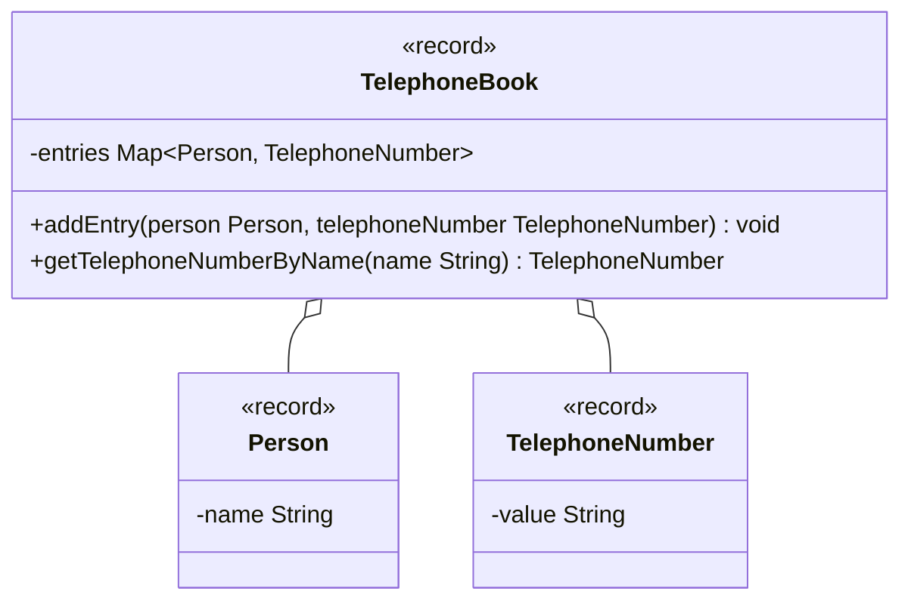

import Exercise from '@site/src/components/Exercise';

- Erstelle die Klassen `Person`, `TelephoneNumber` und `TelephoneBook` anhand
  des abgebildeten Klassendiagramms
- Erstelle eine ausführbare Klasse, welche ein Telefonbuch mit mehreren
  Einträgen erzeugt und zu eingegebenen Namen die dazugehörigen Telefonnummern
  auf der Konsole ausgibt

## Klassendiagramm

## Hinweise zur Klasse TelephoneBook

- Die Methode `void addEntry(person: Person, telephoneNumber: TelephoneNumber)`
  soll einen Eintrag im Telefonbuch anlegen
- Die Methode `TelephoneNumber getTelephoneNumberByName(name: String)` soll die
  Telefonnummer zum eingehenden Namen zurückgeben

<Exercise pullRequest="59" branchSuffix="maps/01" />
