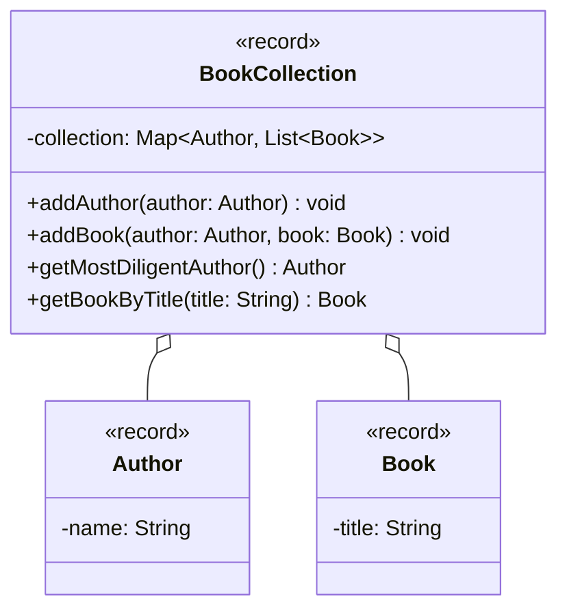

import Exercise from '@site/src/components/Exercise';

- Erstelle die Klassen `Author`, `Book`, `BookCollection` und
  `DuplicateKeyException` anhand des abgebildeten Klassendiagramms
- Erstelle eine ausführbare Klasse, welche eine Büchersammlung mit mehreren
  Autoren und Büchern erzeugt und den fleißigsten Autoren auf der Konsole
  ausgibt

## Klassendiagramm

## Hinweise zur Klasse _BookCollection_

- Die Methode `void addAuthor(author: Author)` soll den eingehenden Autor der
  Büchersammlung hinzufügen. Für den Fall, dass der Autor bereits in der
  Büchersammlung vorhanden ist, soll die Ausnahme `DuplicateKeyException`
  ausgelöst werden
- Die Methode `void addBook(author: Author, book: Book)` soll das eingehende
  Buch der Büchersammlung hinzufügen
- Die Methode `Author getMostDiligentAuthor()` soll den Autoren mit den meisten
  Büchern in der Büchersammlung zurückgeben
- Die Methode `Book getBookByTitle(title: String)` soll das Buch zum eingehenden
  Buchtitel zurückgeben

<Exercise pullRequest="66" branchSuffix="maps/02" />
