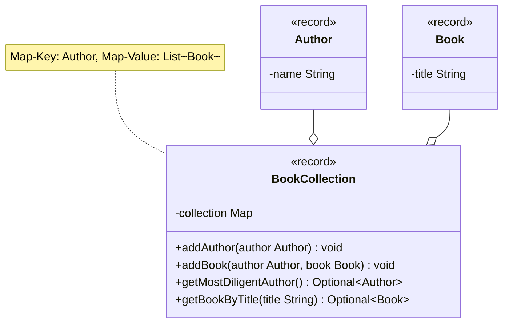

- Passe die Klasse `BookCollection` aus Übungsaufgabe [Maps02](../maps/maps02) anhand des abgebildeten Klassendiagramms an
- Passe die ausführbare Klasse aus Übungsaufgabe [Maps02](../maps/maps02) so an, dass entweder die gefundenen Werte oder alternativ entsprechende Meldungen ausgegeben werden

## Klassendiagramm

