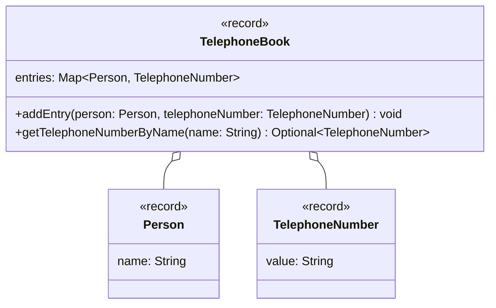

import Exercise from '@site/src/components/Exercise';

- Passe die Klasse `TelephoneBook` aus Übungsaufgabe [Maps01](../maps/maps01)
  anhand des abgebildeten Klassendiagramms an
- Passe die ausführbare Klasse aus Übungsaufgabe [Maps01](../maps/maps01) so an,
  dass entweder die gefundenen Werte oder alternativ entsprechende Meldungen
  ausgegeben werden

## Klassendiagramm

<Exercise pullRequest="100" branchSuffix="optionals/02" />
