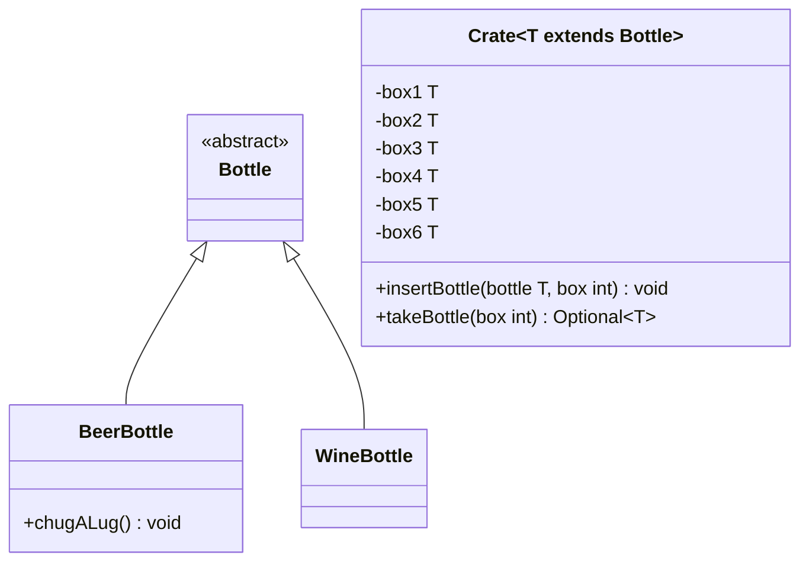

- Passe die Klasse `Crate` aus Übungsaufgabe [Generics02](../generics/generics02) anhand des abgebildeten Klassendiagramms an
- Passe die ausführbare Klasse aus Übungsaufgabe [Generics02](../generics/generics02) so an, dass entweder die gefundenen Werte oder alternativ entsprechende Meldungen ausgegeben werden

## Klassendiagramm

