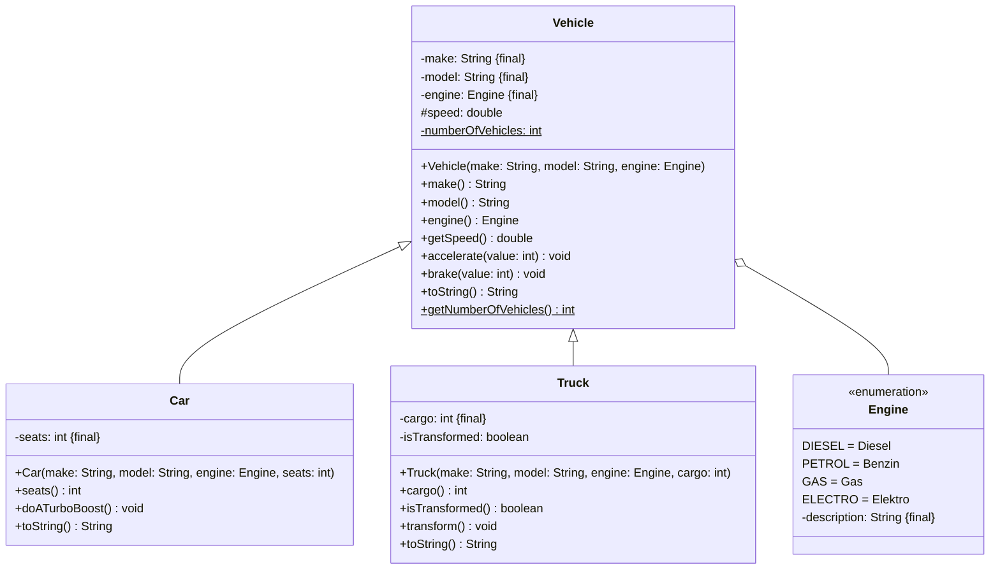

import Exercise from '@site/src/components/Exercise';

- Passe die Klasse `Vehicle` aus Übungsaufgabe
  [Enumerations01](../enumerations/enumerations01) anhand des abgebildeten
  Klassendiagramms an und erstelle die Klassen `Car` und `Truck`
- Passe die ausführbare Klasse aus Übungsaufgabe
  [Enumerations01](../enumerations/enumerations01) so an, dass keine Fahrzeuge,
  sondern Autos und Lastwagen erzeugt und ausgegeben werden

## Klassendiagramm



## Hinweise zur Klasse _Car_

- Der Konstruktor soll alle Attribute initialisieren
- Die Methode `void doATurboBoost()` soll die Geschwindigkeit verdoppeln

## Hinweise zur Klasse _Truck_

- Der Konstruktor soll alle Attribute initialisieren
- Die Methode `void transform()` soll das Attribut isTransformed invertieren

## Konsolenausgabe

```console
Anzahl Fahrzeuge: 0
Anzahl Fahrzeuge: 3
Porsche 911 (Elektro, 2 Sitzplätze)
MAN TGX (Diesel, 20t)
Opel Zafira Life (Diesel, 7 Sitzplätze)
Porsche 911 beschleunigt auf 50 km/h
MAN TGX verwandelt sich in einen Autobot
Porsche 911 macht einen TurboBoost und beschleunigt auf 100 km/h
MAN TGX verwandelt sich in einen Lastwagen zurück
```

<Exercise pullRequest="41" branchSuffix="polymorphy/01" />
