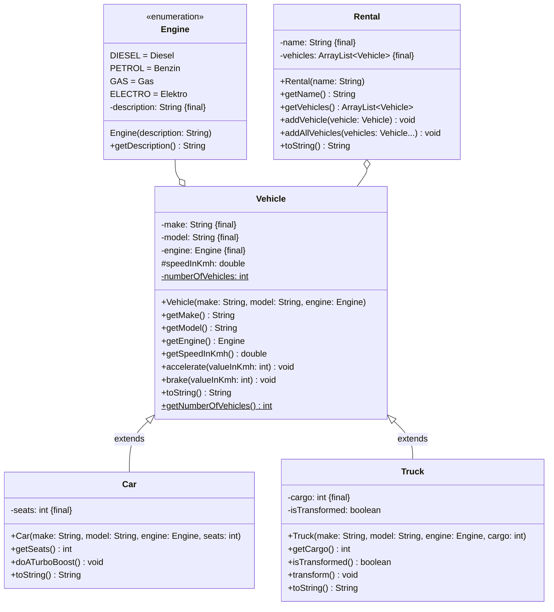

import Exercise from '@site/src/components/Exercise';

- Erstelle die Klasse `Rental` anhand des abgebildeten Klassendiagramms
- Passe die ausführbare Klasse aus Übungsaufgabe [Polymorphy01](polymorphy01) so
  an, dass alle erzeugten Autos und Lastwagen in einer Fahrzeugvermietung
  abgelegt und alle Attribute der Fahrzeugvermietung ausgegeben werden

## Klassendiagramm



## Hinweise zur Klasse _Rental_

- Der Konstruktor soll alle Attribute initialisieren
- Die Methode `void addVehicle(vehicle: Vehicle)` soll der Fahrzeugvermietung
  ein Fahrzeug hinzufügen
- Die Methode `void addAllVehicles(vehicles: Vehicle...)` soll der
  Fahrzeugvermietung mehrere Fahrzeug hinzufügen

## Konsolenausgabe

```console
Fahrzeugvermietung Müller
Unsere Fahrzeuge:
Porsche 911 (Elektro, 2 Sitzplätze)
MAN TGX (Diesel, 20t)
Opel Zafira Life (Diesel, 7 Sitzplätze)
```

<Exercise pullRequest="87" branchSuffix="polymorphy/02" />
