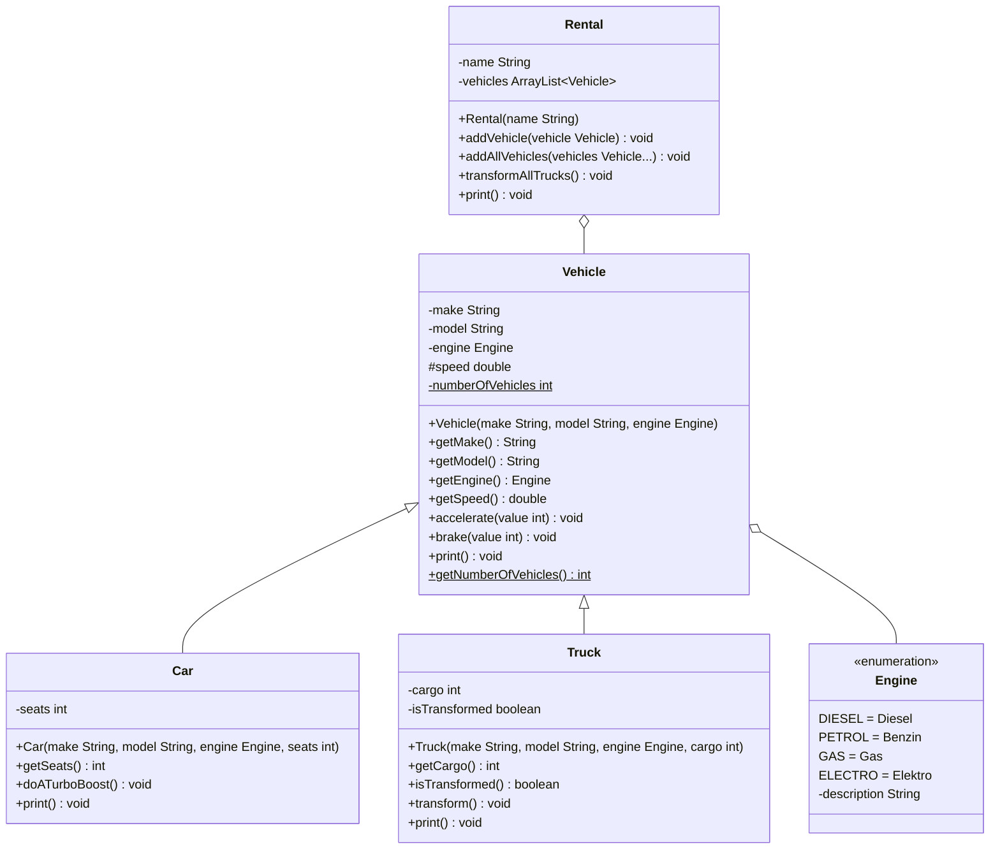

import Exercise from '@site/src/components/Exercise';

- Passe die Klasse `Rental` aus Übungsaufgabe [Polymorphy02](polymorphy02)
  anhand des abgebildeten Klassendiagramms an
- Passe die ausführbare Klasse aus Übungsaufgabe [Polymorphy02](polymorphy02) so
  an, dass sich alle Lastwagen der Fahrzeugvermietung in Autobots verwandeln

## Klassendiagramm

## Hinweis zur Klasse Rental

Die Methode `void transformAllTrucks()` soll alle Lastwagen in Autobots
verwandeln.

<Exercise pullRequest="43" branchSuffix="polymorphy/03" />
