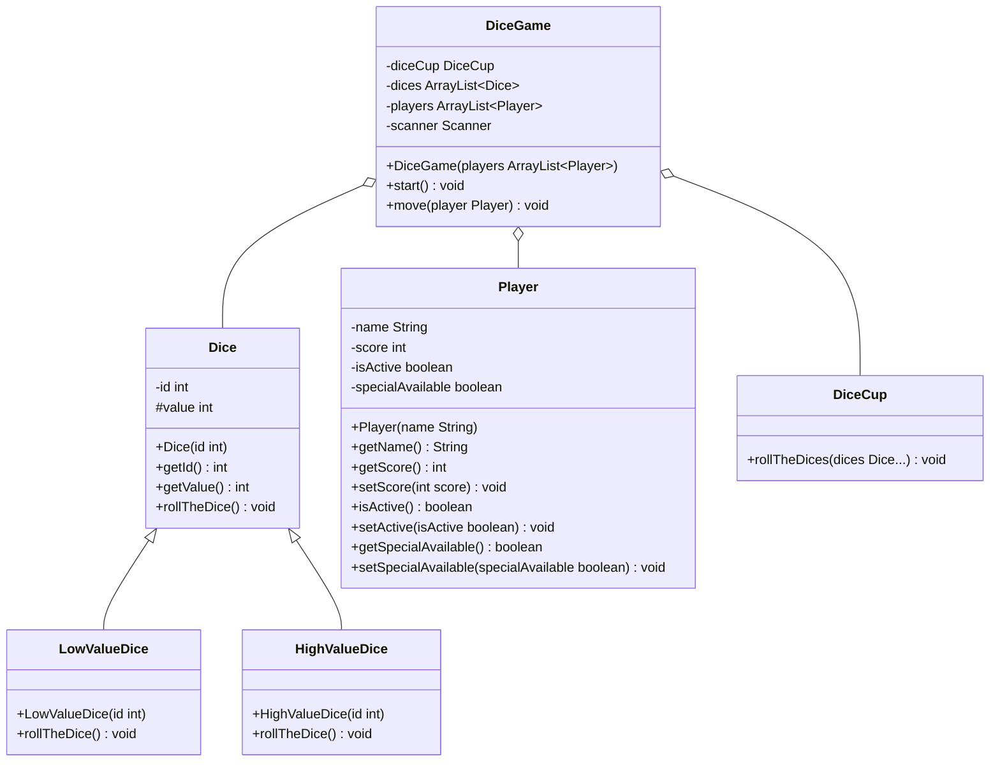

import Exercise from '@site/src/components/Exercise';

- Passe die Klasse `Dice` aus Übungsaufgabe
  [ClassDiagrams02](../uml/class-diagrams02.md) anhand des abgebildeten
  Klassendiagramms an und erstelle die Klassen `HighValueDice` und
  `LowValueDice`
- Passe die Klasse `Player` aus Übungsaufgabe
  [ClassDiagrams02](../uml/class-diagrams02.md) anhand des abgebildeten
  Klassendiagramms an
- Passe die Methode `boolean move(player: Player)` der Klasse `DiceGame` aus
  Übungsaufgabe [ClassDiagrams02](../uml/class-diagrams02.md) so an, dass
  jeder Spieler während des Spiels einmal die Möglichkeit hat, entweder nur
  mit 4-5-6-Würfeln oder 1-2-3-Würfeln zu würfeln

## Klassendiagramm


## Hinweis zur Klasse HighValueDice
Die Methode `void rollTheDice()` soll nur 4er, 5er und 6er "würfeln".

## Hinweis zur Klasse LowValueDice
Die Methode `void rollTheDice()` soll nur 1er, 2er und 3er "würfeln".

## Konsolenausgabe

```console
Hans hat aktuell 0 Punkte
Hans, möchtest Du einmalig Spezialwürfel verwenden (true, false)?: true
Hans, welche Spezialwürfel möchtest Du verwenden (1=4-5-6-Würfel, 2=1-2-3-Würfel)?: 1
Hans, möchtest Du würfeln (true, false)?: true
Hans hat 12 Punkte
Hans hat insgesamt 12 Punkte
…
Lisa hat aktuell 46 Punkte
Lisa, möchtest Du würfeln (true, false)?: true
Lisa hat 12 Punkte
Lisa hat insgesamt 58 Punkte
Lisa hat verloren
Der Sieger heißt Hans und hat 49 Punkte
```

<Exercise pullRequest="44" branchSuffix="polymorphy/04" />
