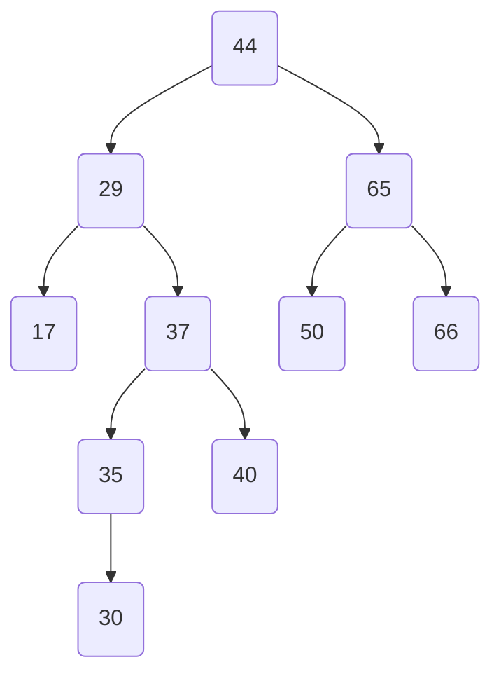
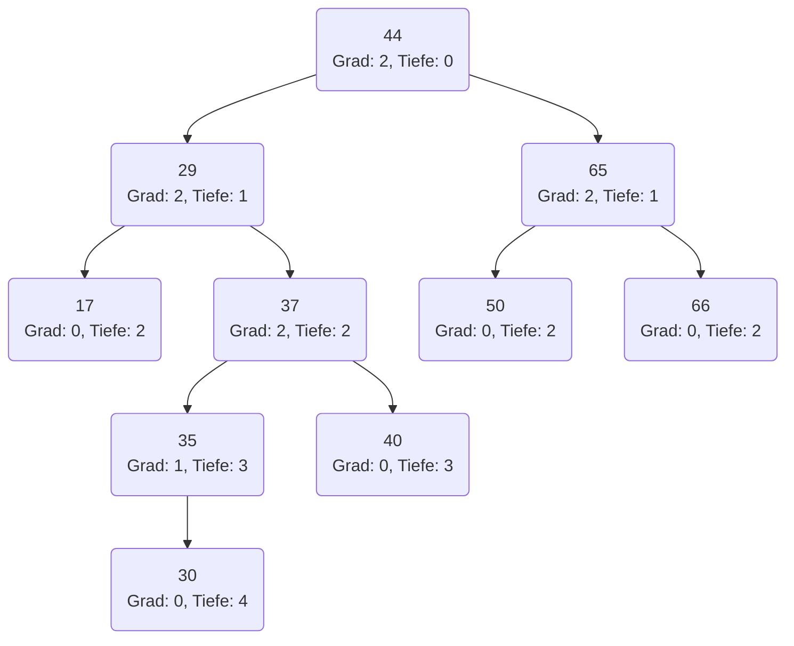

import Tabs from '@theme/Tabs';
import TabItem from '@theme/TabItem';

- Bestimme für den abgebildeten Binärbaum die Höhe
- Bestimme für jeden Knoten des abgebildeten Binärbaums den Grad und die Tiefe
- Traversiere den abgebildeten Binärbaum unter Verwendung des Tiefendurchlaufs
- Traversiere den abgebildeten Binärbaum unter Verwendung des Breitendurchlaufs

## Binärbaum

<Tabs>
  <TabItem value="a" label="-" default>

  </TabItem>
  <TabItem value="b" label="Höhe">

4

  </TabItem>
  <TabItem value="c" label="Grad und Tiefe">

  </TabItem>
  <TabItem value="d" label="Tiefendurchlauf">

44, 29, 17, 37, 35, 30, 40, 65, 50, 66

  </TabItem>
  <TabItem value="e" label="Breitendurchlauf">

44, 29, 65, 17, 37, 50, 66, 35, 40, 30

  </TabItem>
</Tabs>
