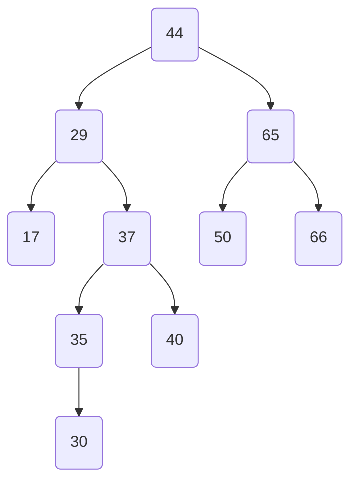

- Bestimme für den abgebildeten Baum die Höhe
- Bestimme für jeden Knoten des abgebildeten Baumes den Grad und die Tiefe
- Traversiere den abgebildeten Baum unter Verwendung des Tiefendurchlaufs
- Traversiere den abgebildeten Baum unter Verwendung des Breitendurchlaufs

