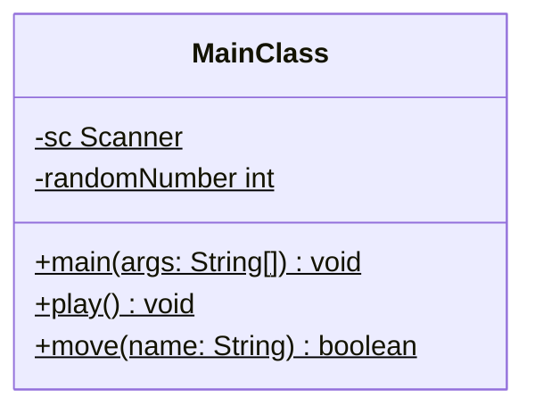
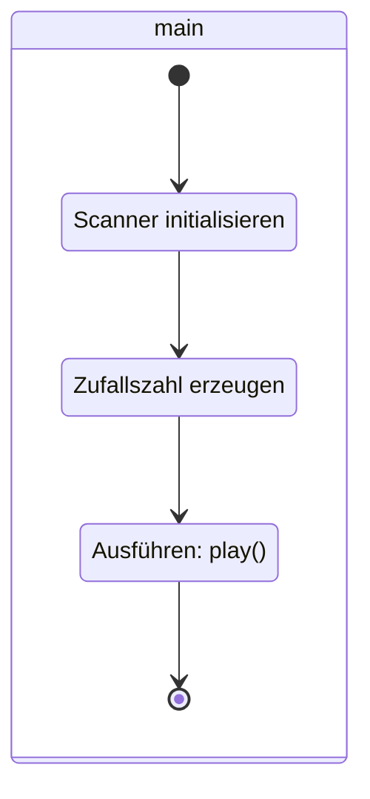
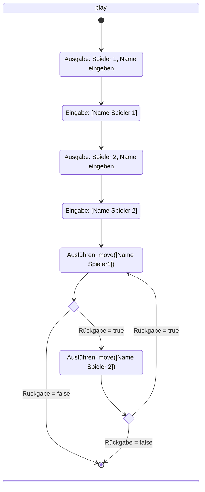
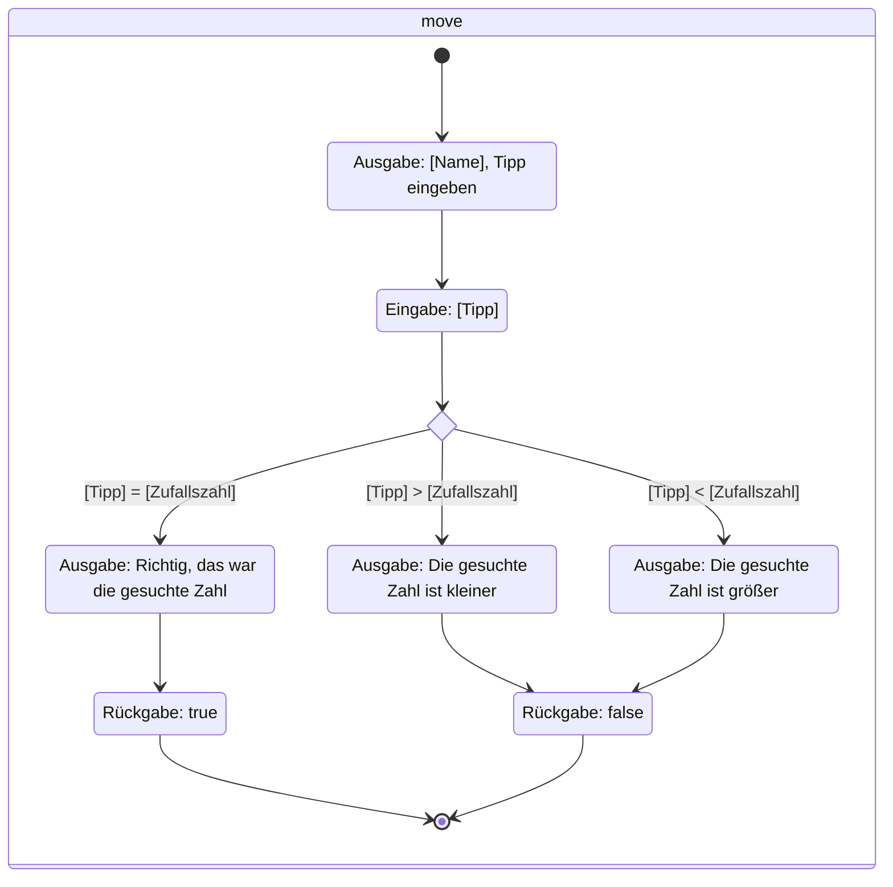

import Exercise from '@site/src/components/Exercise';

Erstelle die Klasse `MainClass` anhand des abgebildeten Klassendiagramms sowie
den abgebildeten Aktivitätsdiagrammen.

## Klassendiagramm

## Aktivitätsdiagramm zur Aktivität main

## Aktivitätsdiagramm zur Aktivität play

## Aktivitätsdiagramm zur Aktivität move

<Exercise pullRequest="35" branchSuffix="activity-diagrams/01" />
