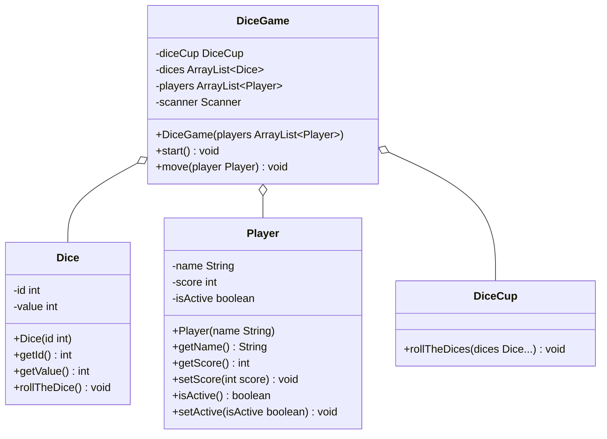

import Exercise from '@site/src/components/Exercise';

- Passe die Klasse `Player` aus Übungsaufgabe
  [ClassDiagrams01](class-diagrams01.md) anhand des abgebildeten
  Klassendiagramms an und erstelle die Klasse `DiceGame`
- Erstelle eine ausführbare Klasse, welche beliebig vielen Spielern ermöglicht,
  abwechselnd mit 3 Würfeln zu würfeln. Für jedes gewürfelte Auge bekommt der
  jeweilige Spieler einen Punkt. Ziel des Spieles ist es, so nah wie möglich an
  50 Punkte heranzukommen, ohne allerdings die 50 Punkte zu überschreiten

## Klassendiagramm



## Hinweis zur Klasse Player

Passe den Konstruktor so an, dass auch weiterhin alle Attribute initialisiert
werden.

## Hinweise zur Klasse DiceGame

- Der Konstruktor soll alle Attribute initialisieren
- Die Methode `void start()` soll die Spieler abwechselnd einen Spielzug machen
  lassen und am Ende den Sieger des Spiels auf der Konsole ausgeben
- Die Methode `void move(player: Player)` soll es dem Spieler ermöglichen zu
  würfeln, bzw. seinen Spielzug zu beenden

## Konsolenausgabe

```console
Hans hat aktuell 0 Punkte
Hans, möchtest Du würfeln (true, false)?: true
Hans hat 8 Punkte
Hans hat insgesamt 8 Punkte
…
Hans hat aktuell 43 Punkte
Hans, möchtest Du würfeln (true, false)?: false
Lisa hat aktuell 41 Punkte
Lisa, möchtest Du würfeln (true, false)?: true
Lisa hat 10 Punkte
Lisa hat insgesamt 51 Punkte
Lisa hat verloren
Der Sieger heißt Hans und hat 43 Punkte
```

<Exercise pullRequest="37" branchSuffix="class-diagrams/02" />
