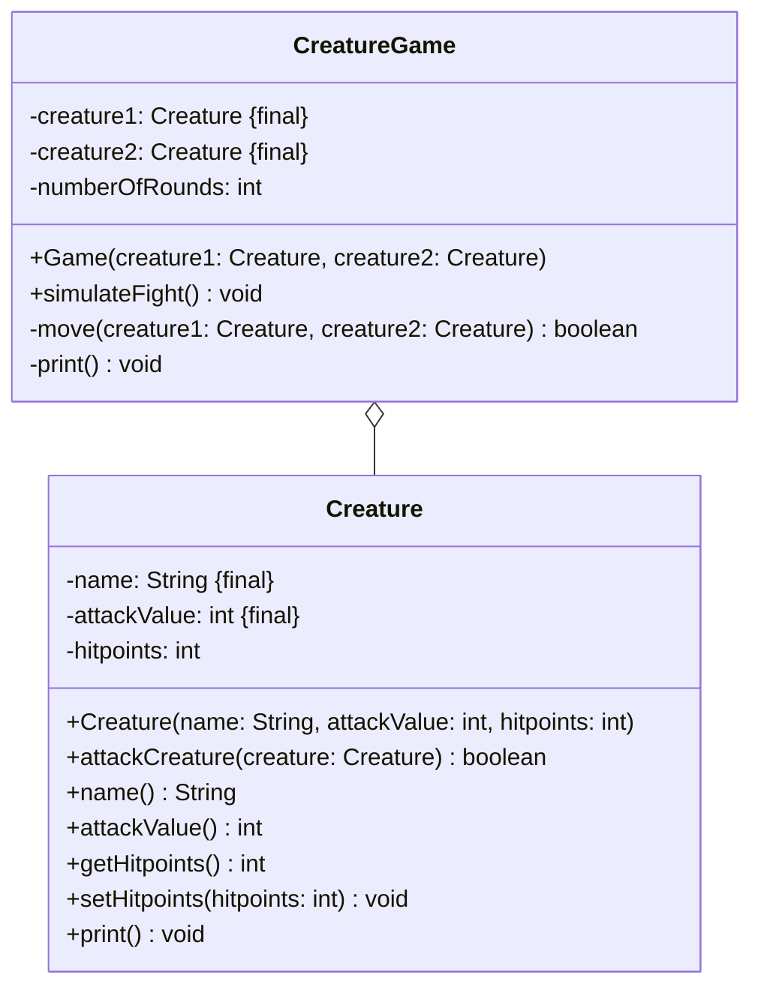

import Exercise from '@site/src/components/Exercise';

- Passe die Klasse `Creature` aus Übungsaufgabe [OO06](../oo/oo06) anhand des
  abgebildeten Klassendiagramms an und Erstelle die Klasse `CreatureGame`
- Erstelle eine ausführbare Klasse, welche einen Kampf zwischen zwei Kreaturen
  simuliert

## Klassendiagramm



## Hinweise zur Klasse _Creature_

- Passe die Methode `boolean attack(creature: Creature)` so an, dass der
  Rückgabewert `true` ist, wenn die Lebenspunkte der angegriffenen Kreatur
  kleiner gleich Null sind, bzw. `false`, wenn nicht
- Die Methode `void print()` soll alle Attribute auf der Konsole ausgeben

## Hinweise zur Klasse _CreatureGame_

- Der Konstruktor soll alle Attribute initialisieren
- Die Methode `void simulateFight()` soll die beiden Kreaturen sich so lange
  gegenseitig angreifen lassen, bis eine der Kreaturen "stirbt"
- Die Methode `boolean move(creature1: Creature, creature2: Creature)` soll eine
  Kreatur die andere angreifen lassen und den Rückgabewert `true` liefern, wenn
  die angegriffene Kreatur "stirbt", bzw. `false`, wenn nicht
- Die Methode `void print()` soll alle Attribute auf der Konsole ausgeben

## Konsolenausgabe

```console
Runde 1: Zombie (2 - 10), Vampir (4 - 6)
Zombie greift Vampir an und erzielt 2 Schaden
Vampir hat noch 4 Lebenspunkte
Vampir greift Zombie an und erzielt 4 Schaden
Zombie hat noch 6 Lebenspunkte
…
Runde 3: Zombie (2 - 2), Vampir (4 - 2)
Zombie greift Vampir an und erzielt 2 Schaden
Vampir wurde vernichtet
```

<Exercise pullRequest="38" branchSuffix="class-diagrams/03" />
