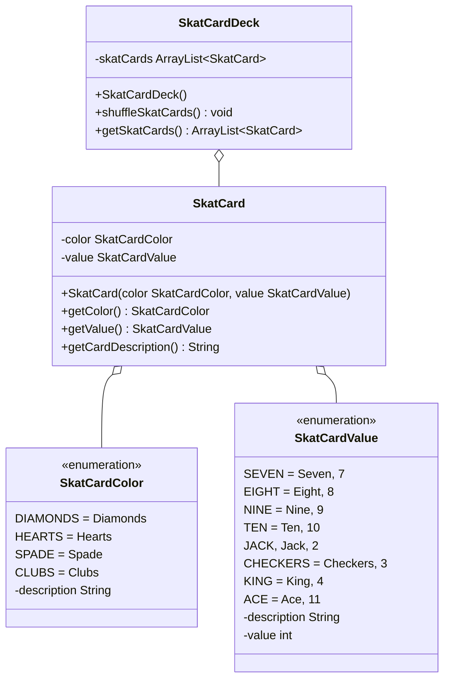

import Exercise from '@site/src/components/Exercise';

- Erstelle die Aufzählungen `SkatCardColor` und `SkatCardValue` sowie die
  Klassen `SkatCard` und `SkatCardDeck` anhand des abgebildeten Klassendiagramms
- Erstelle eine ausführbare Klasse, welche ein Skatblatt erzeugt, mischt und
  auf der Konsole ausgibt

## Klassendiagramm



## Hinweise zur Klasse SkatCardDeck

- Der Konstruktor soll ein Skatblatt, bestehend aus 32 Karten, erzeugen
- Die Methode `void shuffleSkatCards()` soll das Skatblatt mischen

## Konsolenausgabe

```console
Kreuz König
Pik 10
Kreuz 9
Pik 9
Kreuz Bube
Pik Ass
Herz Bube
Karo Bube
Pik 8
Karo Dame
…
```

## Hinweis

Die statische Methode `T[] values()` einer Aufzählung gibt alle
Aufzählungskonstanten der Aufzählung als Feld zurück.

<Exercise pullRequest="40" branchSuffix="class-diagrams/05" />
