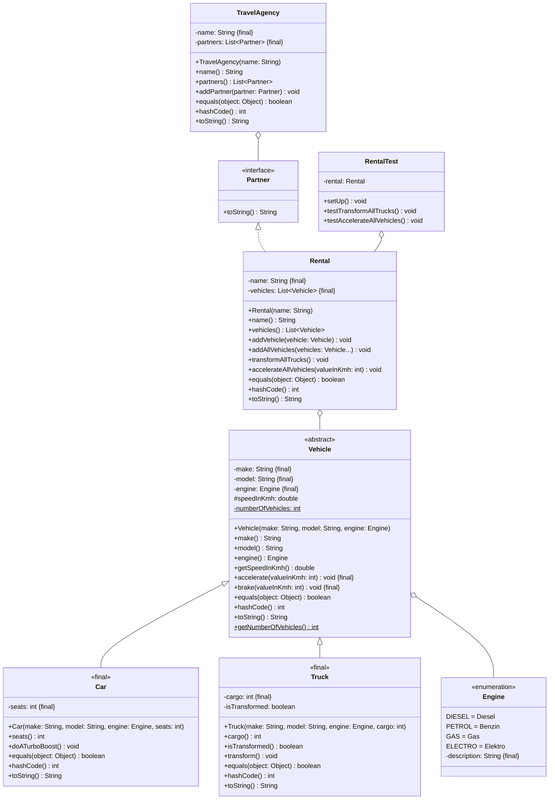

Erstelle die JUnit5-Testklasse `RentalTest` und erweitere die Klasse `Rental`
aus Übungsaufgabe [Exceptions01](../exceptions/exceptions01) anhand des
abgebildeten Klassendiagramms.

## Klassendiagramm

## Hinweis zur Klasse _Rental_

Die Methode `void accelerateAllVehicles(valueInKmh: int)` soll alle Fahrzeuge
der Fahrzeugvermietung um den eingehenden Wert beschleunigen.

## Hinweise zur Klasse _RentalTest_

- Die Lebenszyklus-Methode `void setUp()` soll eine Fahrzeugvermietung samt
  dazugehöriger Fahrzeuge erzeugen
- Die Testmethode `void testTransformAllTrucks()` soll prüfen, ob nach Ausführen
  der Methode `void transformAllTrucks()` der Klasse `Rental` alle Lastwagen in
  Autobots umgewandelt werden und nach erneutem Ausführen wieder
  zurückverwandelt werden
- Die Testmethode `void testAccelerateAllVehicles()` soll prüfen, ob beim
  Ausführen der Methode `void accelerateAllVehicles(valueInKmh: int)` der Klasse
  `Rental` mit einem negativen Wert die Ausnahme `InvalidValueException`
  ausgelöst wird
