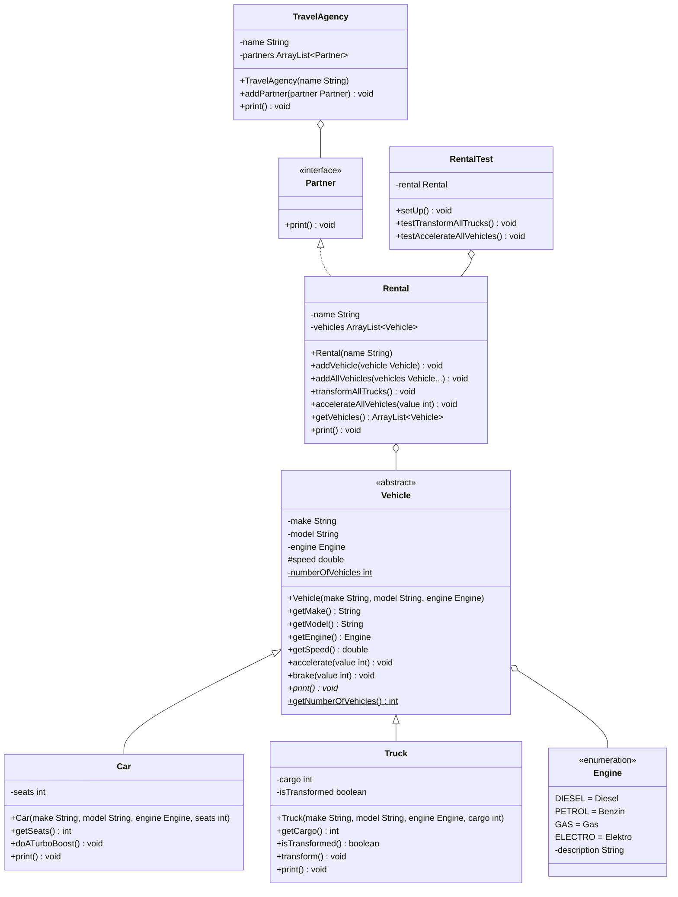

Erstelle die Klasse `RentalTest` und erweitere die Klasse `Rental` aus Übungsaufgabe [Exceptions01](../exceptions/exceptions01.md) anhand des abgebildeten Klassendiagramms.

## Klassendiagramm

## Hinweis zur Klasse Rental
Die Methode `void accelerateAllVehicles(value: int)` soll alle Fahrzeuge der Fahrzeugvermietung um den eingehenden Wert beschleunigen.

## Hinweise zur Klasse RentalTest
- Die Lebenszyklus-Methode `void setUp()` soll eine Fahrzeugvermietung samt dazugehöriger Fahrzeuge erzeugen
- Die Testmethode `void testTransformAllTrucks()` soll prüfen, ob nach Ausführen der Methode `void transformAllTrucks()` der Klasse `Rental` alle Lastwagen in Autobots umgewandelt werden und nach erneutem Ausführen wieder zurückverwandelt werden
- Die Testmethode `void testAccelerateAllVehicles(int)` soll prüfen, ob beim Ausführen der Methode `void accelerateAllVehicles(value: int)` der Klasse `Rental` mit einem negativen Wert die Ausnahme `InvalidValueException` ausgelöst wird
