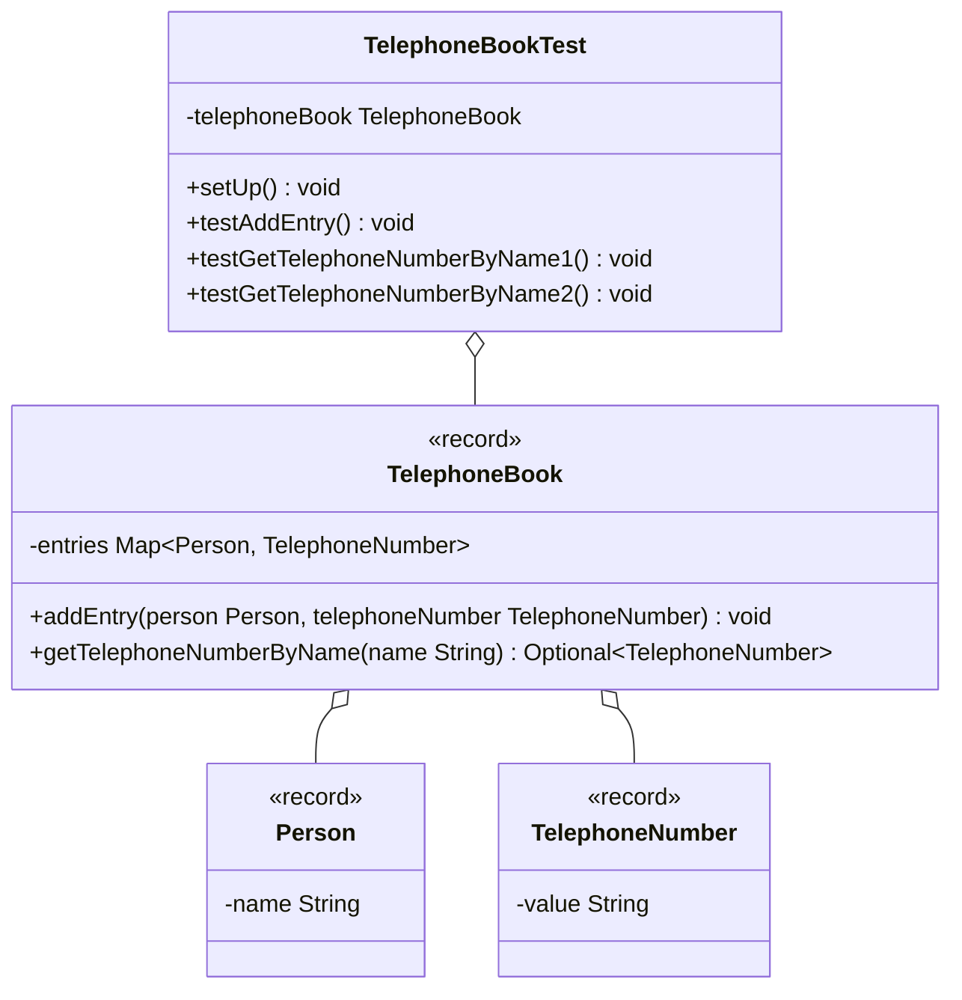

Erstelle die JUnit5-Testklasse `TelephoneBookTest` anhand des abgebildeten
Klassendiagramms.

## Klassendiagramm

## Hinweise zur Klasse `TelephoneBookTest`

- Die Lebenszyklus-Methode `void setUp()` soll ein Telefonbuch samt
  dazugehöriger Einträge erzeugen
- Die Testmethode `void testAddEntry()` soll prüfen, ob nach dem Ausführen der
  Methode `void addEntry(person: Person, telephoneNumber: TelephoneNumber)` mit
  einer Person, zu der es bereits einen Eintrag im Telefonbuch gibt, die
  Telefonnummer aktualisiert wurde
- Die Testmethode `void testGetTelephoneNumberByName1()` soll prüfen, ob beim
  Ausführen der Methode
  `Optional<TelephoneNumber> getTelephoneNumberByName(name: String)` mit einem
  Namen, zu dem es eine entsprechende Person im Telefonbuch gibt, die
  dazugehörige Telefonnummer als Optional zurückgegeben wird
- Die Testmethode `void testGetTelephoneNumberByName2()` soll prüfen, ob beim
  Ausführen der Methode
  `Optional<TelephoneNumber> getTelephoneNumberByName(name: String)` mit einem
  Namen, zu dem es keine entsprechende Person im Telefonbuch gibt, ein leeres
  Optional zurückgegeben wird

## Hinweis

Verweden die Klasse `TelephoneBook` aus Übungsaufgabe
[Optionals02](../optionals/optionals02).
