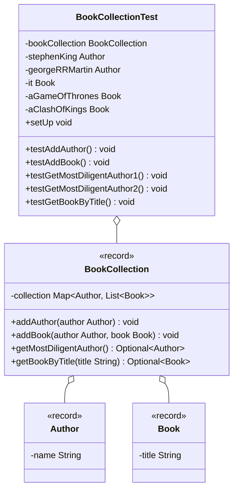

Erstelle die Klasse `BookCollectionTest` anhand des abgebildeten
Klassendiagramms.

## Klassendiagramm

## Hinweise zur Klasse `BookCollectionTest`

- Die Lebenszyklus-Methode `void setUp()` soll den Attributen der Testklasse
  passende Werte zuweisen
- Die Testmethode `void testAddAuthor()` soll prüfen, ob beim Ausführen der
  Methode `void addAuthor(author: Author)` mit einem Autoren, der bereits in der
  Büchersammlung vorhanden ist, die Ausnahme `DuplicateKeyException` ausgelöst
  wird
- Die Testmethode `void testAddBook()` soll prüfen, ob nach dem Ausführen der
  Methode `void addBook(author: Author, book: Book)` der entsprechende Eintrag
  aktualisiert wurde
- Die Testmethode `void testGetMostDiligentAuthor1()` soll prüfen, ob beim
  Ausführen der Methode `Optional<Author> getMostDiligentAuthor()` auf eine
  befüllte Büchersammlung der Autor mit den meisten Büchern in der
  Büchersammlung als Optional zurückgegeben wird
- Die Testmethode `void testGetMostDiligentAuthor2()` soll prüfen, ob beim
  Ausführen der Methode `Optional<Author> getMostDiligentAuthor()` auf eine
  leere Büchersammlung ein leeres Optional zurückgegeben wird
- Die Testmethode `void testGetBookByTitle()` soll prüfen, ob beim Ausführen der
  Methode `Optional<Book> getBookByTitle(title: String)` mit einem Buchtitel zu
  einem vorhandenen Buch das entsprechende Buch als Optional zurückgegeben wird
  und ob beim Ausführen der Methode
  `Optional<Book> getBookByTitle(title: String)` mit einem Buchtitel zu einem
  nicht vorhandenen Buch ein leeres Optional zurückgegeben wird

## Hinweis

Verweden die Klasse `BookCollection` aus Übungsaufgabe
[Optionals01](../optionals/optionals01.md).
